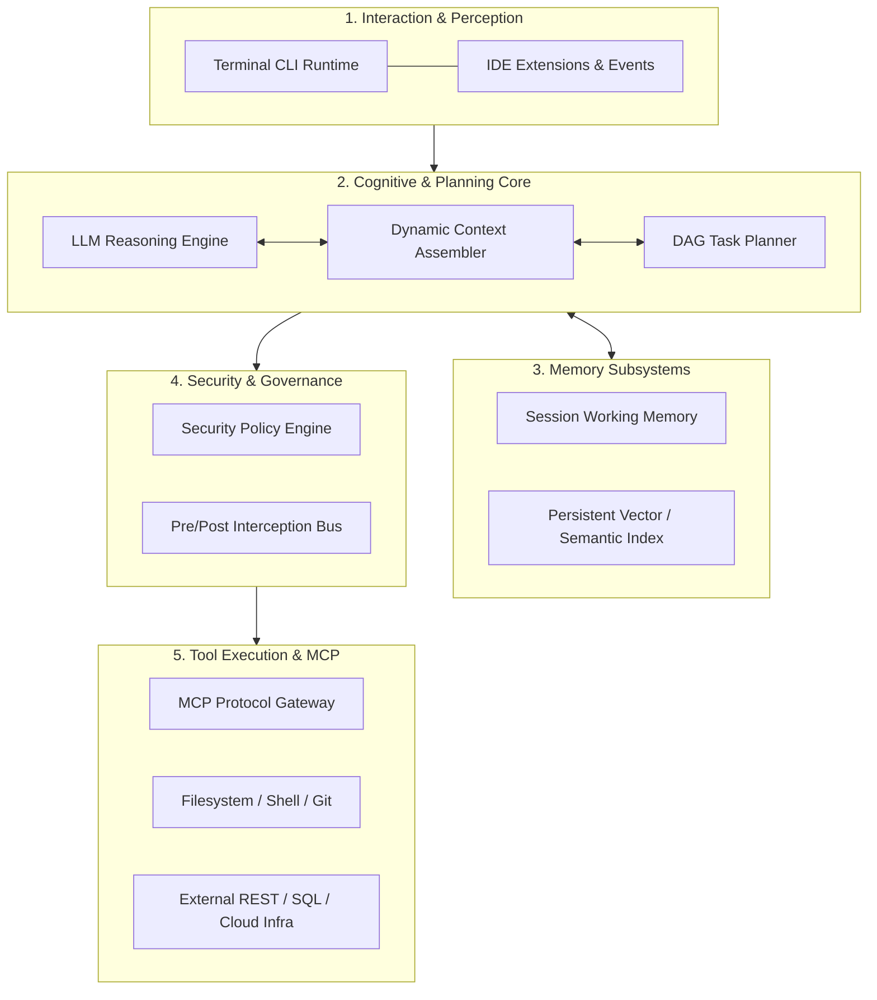

# The Grand Architecture of Modern Agent Systems

Synthesizing production-grade agent runtimes (such as Claude Code, Pi, and Devin), a resilient autonomous system comprises a five-tier decoupled architecture:

## Architectural Tier Responsibilities

1. **Perception**: Ingests user intents, shell exits, and environment hooks.
2. **Cognition**: Prompt orchestration, semantic decomposition, and reflection.
3. **Memory**: Tiered caching between active working windows and repository indexing.
4. **Governance**: Human-in-the-loop approvals, sandbox fences, and token budgets.
5. **Action**: Standardized tool execution via MCP and native OS syscalls.
