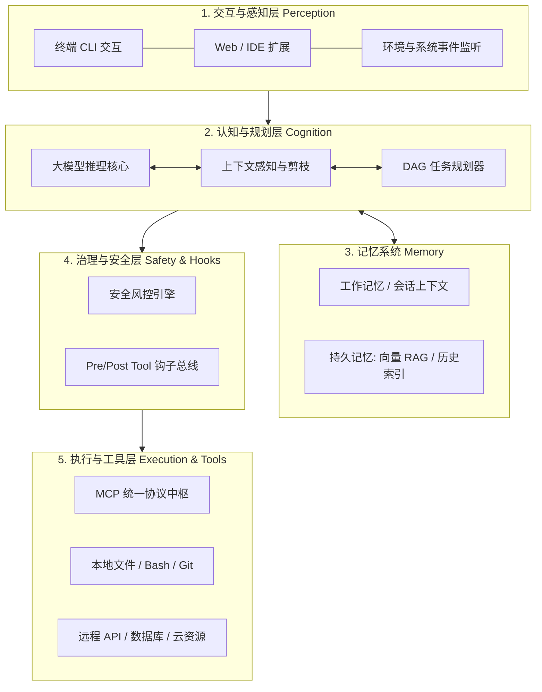

# Agent 系统全景架构设计

综合现代工业级 Agent（如 Claude Code、Devin、Pi）的演进，一个健壮的自主智能体系统由以下五层架构构成：

## 核心架构分层职责

1. **交互与感知层**：捕获用户意图、终端状态变化与上下文触发器。
2. **认知与规划层**：负责意图理解、Prompt 装配、任务分解与反思纠错。
3. **记忆系统**：分层存储短期会话缓存与长期代码库索引。
4. **安全与治理层**：实现人机协同（Human-in-the-loop）审批与沙箱隔离。
5. **执行与工具层**：基于 MCP 与系统原生能力执行真实的物理世界变更。

---

> 🔗 **微信公众号原文**：[Agent 系统全景图](http://mp.weixin.qq.com/s?__biz=Mzk0NzYxMDM0Mw==&mid=2247484243&idx=1&sn=4e85086b43acded7a3e7cd560af5d9ca)
