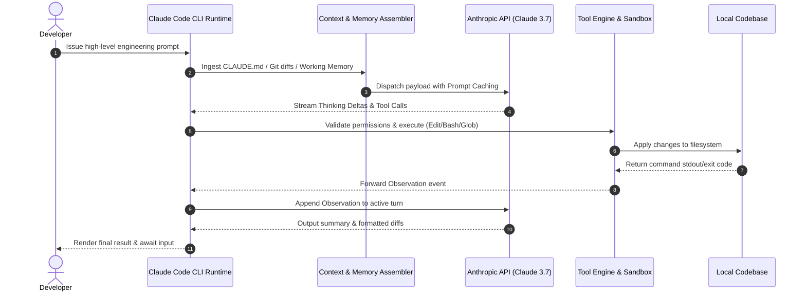

# Inside Claude Code: Architectural Execution Pipeline

Tracing the underlying mechanics of Claude Code reveals a modular **7-stage execution lifecycle**:

## Core Subsystem Breakdown

1. **Context Assembler**: Aggregates Git statuses, token-pruned historical trees, and system guidelines.
2. **Streaming Event Loop**: Handles Server-Sent Events (SSE), resolving thinking protocols and partial tool dispatches.
3. **Execution Sandbox**: Intercepts elevated syscalls and handles clean state rollbacks upon receiving interrupt signals (`SIGINT`).
