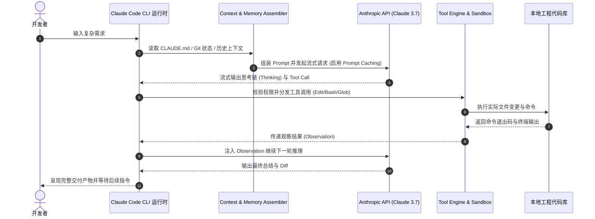

# Claude Code 内部架构剖析与执行链路

深入底层源码与运行机制，Claude Code 的端到端执行链路可以划分为清晰的 **7 步生命周期**：

## 核心内部子系统职责

1. **Context Assembler（上下文装配器）**：动态聚合 Git Diffs、近期访问文件列表与项目宪法，精准利用 Prompt Caching。
2. **Streaming Event Loop（流式事件循环）**：实时处理 SSE 事件流中的 `thinking_delta` 与 `tool_use_delta`。
3. **Execution Sandbox（安全执行沙箱）**：隔离危险系统调用，支持中断信号（SIGINT / Ctrl+C）安全回退。

---

> 🔗 **微信公众号原文**：[Claude Code 内部架构](http://mp.weixin.qq.com/s?__biz=Mzk0NzYxMDM0Mw==&mid=2247484307&idx=1&sn=119bf0a30cc3f9beb210b12243290765)
