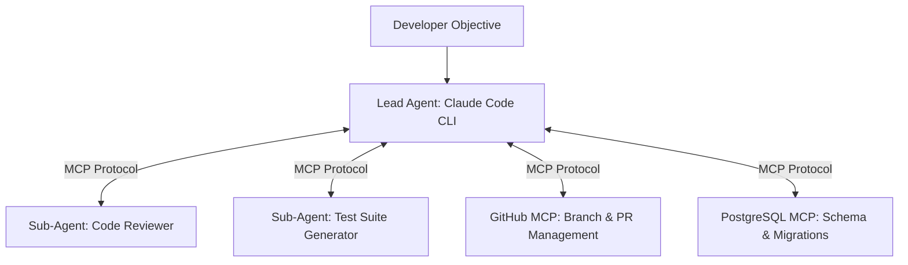

# Claude Code MCP & Multi-Agent Collaboration

When complex initiatives cross disparate architectural domains, **MCP integrations and multi-agent swarms** provide the necessary coordination framework.

## 1. Expanding Capabilities via MCP

Claude Code natively connects to standard MCP Servers:
- **GitHub MCP**: Pulls issue specifications, opens review threads, and submits PRs.
- **Postgres / Redis MCP**: Analyzes slow queries, table locks, and migration drifts.
- **Browser MCP**: Runs headless Playwright scripts for automated end-to-end frontend verification.

## 2. Context Isolation Benefits

Delegating sub-tasks to ephemeral sub-agents isolates working contexts:
- Prevents main session windows from bloating with voluminous test or compiler outputs.
- Sub-agents summarize findings before returning control, optimizing token consumption.
