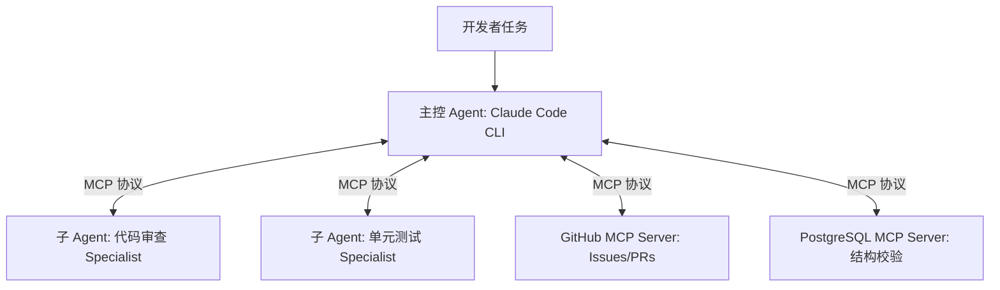

# Claude Code MCP 与多 Agent 协作

当单一 Agent 面临跨系统、跨领域的复杂交付时，**MCP 协议与多 Agent 协同（Multi-Agent Swarm）** 成为了终极解法。

## 1. 通过 MCP 扩展 Claude Code 的能力边界

通过简单的配置，Claude Code 可以直接挂载任意标准 MCP Server：
- **GitHub MCP**：自动读取 Issue 描述、创建分支、提交 Pull Request。
- **Postgres / Redis MCP**：直接在终端排查线上库表死锁与慢查询。
- **Browser MCP**：调用无头浏览器（Playwright）进行 E2E 端到端前端渲染测试。

## 2. 多 Agent 协同的上下文隔离优势

让主控 Agent 派发子任务给特定专家 Agent（Sub-agents），能够实现**上下文物理隔离**：
- 避免主对话窗口被成千上万行临时测试日志撑爆；
- 专家 Agent 执行完毕后仅向上级汇报结构化总结，极大节省 Token 成本。

---

> 🔗 **微信公众号原文**：[Claude Code MCP 与多 Agent 协作](http://mp.weixin.qq.com/s?__biz=Mzk0NzYxMDM0Mw==&mid=2247484295&idx=1&sn=deb415cc553c359b0a4303f09169087a)
