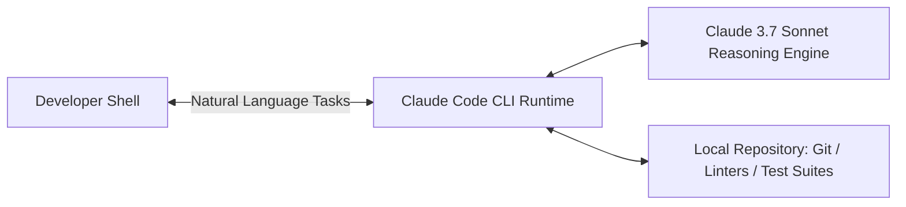

# Claude Code: High-Level Overview & Philosophy

**Claude Code** represents Anthropic's flagship agentic coding interface. Unlike conventional IDE chat sidebars, Claude Code operates as a **first-class terminal native agent** integrated directly into developer environments.

## 1. Core Architectural Tenets

- **Terminal-First Workflow**: Operates directly in standard development environments, eliminating context switching between editor and CLI.
- **Autonomous Agentic Loop**: Moves beyond simple autocomplete to locate relevant files, perform edits, run unit tests, and self-correct on failures.
- **Context Grounding**: Uses `CLAUDE.md` and repository indexing to align with existing architecture and coding standards.
