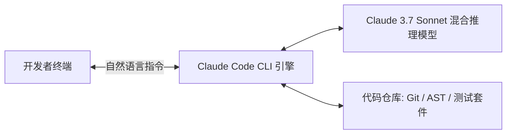

# Claude Code 总览与设计哲学

**Claude Code** 是 Anthropic 推出的下一代终端自主编程 Agent。与传统 IDE 侧边栏 Chatbot 不同，Claude Code 真正扎根于**命令行（CLI）与工程仓库底层**。

## 1. Claude Code 的核心设计哲学

- **Terminal First（终端优先）**：直接在开发者的实际工作环境中运行，无需离开终端即可完成编码、编译、排错与 Git 提交。
- **Agentic Loop（自主执行闭环）**：不仅仅是给出代码建议，而是自动定位文件、修改代码、执行测试并根据报错自我修正。
- **Deep Repo Comprehension（深度仓库感知）**：通过自动发现 `CLAUDE.md` 与工程索引，快速掌握任意大型代码库的架构与规范。

---

> 🔗 **微信公众号原文**：[Claude Code 总览](http://mp.weixin.qq.com/s?__biz=Mzk0NzYxMDM0Mw==&mid=2247484265&idx=1&sn=1a741a340608d434bcc27bb8c8ba9a24)
