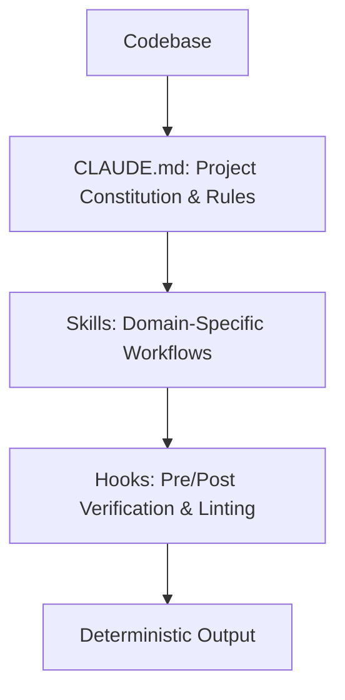

# CLAUDE.md, Custom Skills & Hooks in Practice

Within the Claude Code ecosystem, **`CLAUDE.md`**, **Skills**, and **Hooks** form the tripartite engine for tailoring autonomous agents to specific software repositories.

## 1. Best Practices for `CLAUDE.md`

Placed at the repository root, `CLAUDE.md` serves as the primary system prompt extension:
- **Build & Test Commands**: Explicit test runner scripts (`pnpm test`, `cargo check`).
- **Architectural Guidelines**: Layering conventions and dependency rules.
- **Strict Invariants**: Prohibited patterns (e.g., "Never modify migration files directly", "No inline secrets").

## 2. Synergies Between Skills and Hooks

- **Skills**: Modular capability packages implementing complex domain logic.
- **Hooks**: Automated gates triggering linters or formatters after file modifications to enforce code standards.
