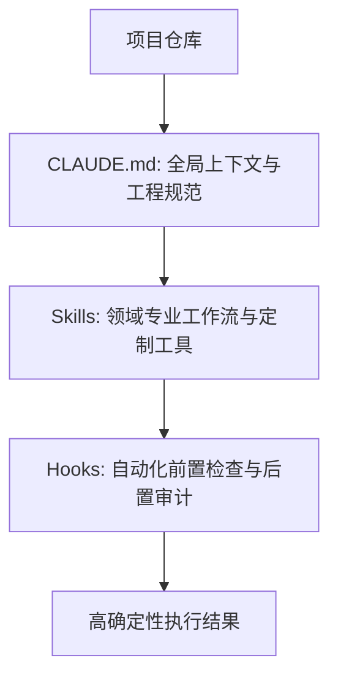

# CLAUDE.md、Skills 与 Hooks 实战

在 Claude Code 体系中，**`CLAUDE.md`、Skills（技能扩展）与 Hooks（生命周期钩子）** 构成了定制专属研发 Agent 的三驾马车。

## 1. `CLAUDE.md` 编写黄金法则

`CLAUDE.md` 放置在项目根目录，是 Agent 启动时最先读取的“项目宪法”：
- **构建与测试命令**（如 `pnpm build`, `go test ./...`）。
- **代码架构分层与目录约定**。
- **严格的代码禁止事项**（如“禁止直接提交主分支”、“禁止在前端写硬编码 API Key”）。

## 2. Skills 与 Hooks 的联动

- **Skills**：将团队特定的复杂操作（如“运行数据库回滚演练”、“一键部署测试环境”）封装为可复用的技能指令。
- **Hooks**：在 Agent 执行 `edit` 或 `bash` 动作前后，自动执行 `golangci-lint` 或 `eslint`，保证生成代码绝对符合格式规范。

---

> 🔗 **微信公众号原文**：[CLAUDE.md、Skills 与 Hooks](http://mp.weixin.qq.com/s?__biz=Mzk0NzYxMDM0Mw==&mid=2247484273&idx=1&sn=392dea01a0ae4b798681be00ae3f8d19)
