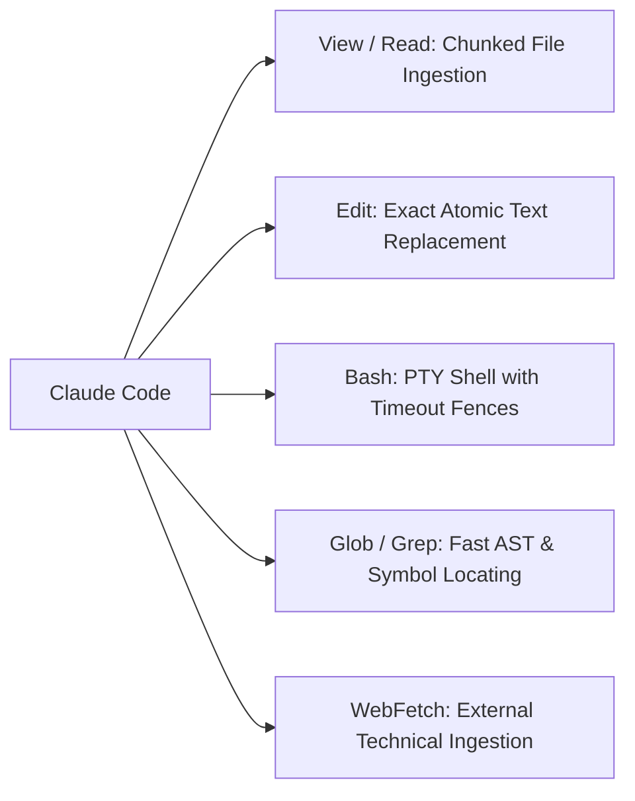

# The Claude Code Tool Execution Subsystem

The efficacy of Claude Code relies heavily on its refined **Native Tool Subsystem**, engineered specifically for repository manipulation and deterministic execution.

## 1. Atomic Edit vs. Full-File Rewriting

Rewriting entire files during refactoring introduces critical drawbacks:
- **Token Inefficiency**: Modifying two lines in a 2,000-line file burns excessive output tokens.
- **Accidental Regressions**: Hallucinatory omissions frequently degrade unrelated helper functions.
- **Atomic Edit Model**: Enforces strict `oldText -> newText` exact-match replacements, ensuring minimal, deterministic diffs.

## 2. PTY Bash Execution & Sandbox Controls

- Real-time `stdout` and `stderr` capturing with streaming backpressure.
- Execution timeouts and signal handling for runaway processes.
- Strict human-in-the-loop authorization gates for elevated commands.
