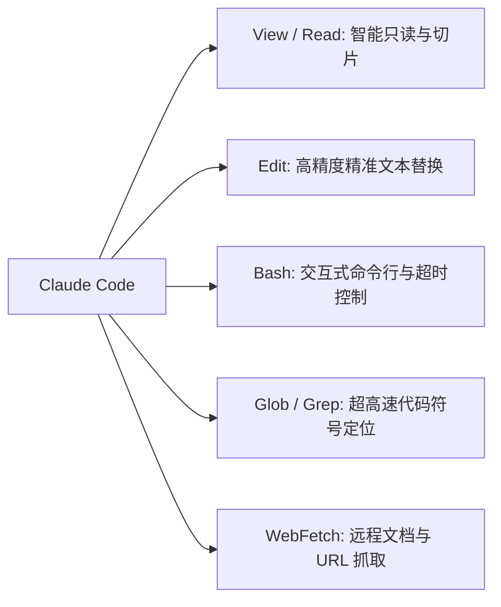

# Claude Code 工具系统（Tool Use 进阶）

Claude Code 的强大不仅源于底座模型，更在于其高度精炼的**原生工具系统（Native Toolset）**。

## 1. 为什么“精准替换 (Edit)”优于“全文件重写”？

很多初级 Agent 采用全量重写整个文件的方式，存在致命缺陷：
- **Token 消耗巨大**：一个 2000 行的文件只改 2 行，全量输出会浪费数千 Token 并显著增加延迟。
- **引入意外回归**：模型在重新输出长代码时极容易“幻觉丢弃”无关的代码逻辑。
- **Claude Code Edit 策略**：通过严格的 `oldText -> newText` 精准匹配，确保每次变更都是原子、最小且确定性的。

## 2. Bash 工具的安全沙箱与流式监控

Claude Code 的 Bash 工具支持：
- 实时捕获 `stdout` / `stderr`；
- 超时中断与异常信号处理；
- 高危命令拦截与人机确认机制。

---

> 🔗 **微信公众号原文**：[Claude Code 工具系统](http://mp.weixin.qq.com/s?__biz=Mzk0NzYxMDM0Mw==&mid=2247484289&idx=1&sn=2319ec643946418c14a893f1ee801a3d)
