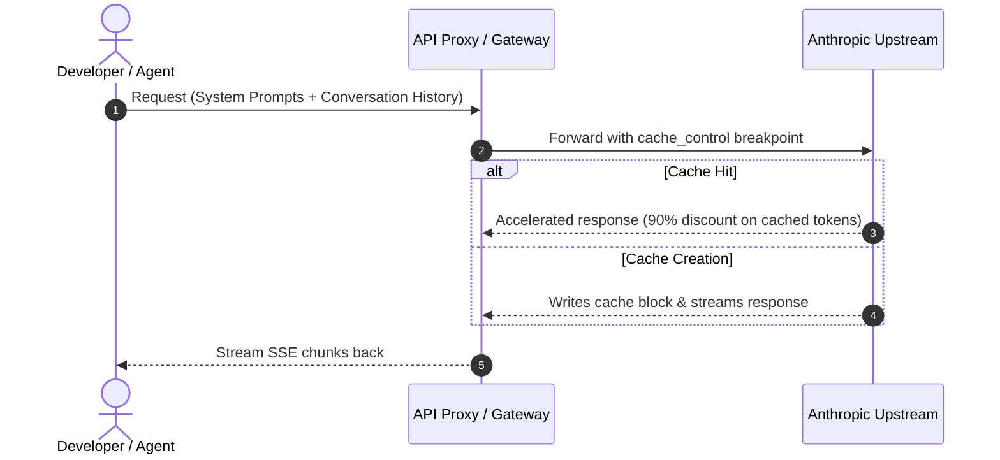

# Optimizing Claude API Costs & Latency with Prompt Caching


In long-context LLM interactions, **input tokens typically account for over 80% of total API expenses**. Anthropic's **Prompt Caching** capability slashes cache-read input token costs by up to **90%**, while substantially decreasing Time to First Token (TTFT).



## 1. Prerequisites & Thresholds

- **Minimum Token Threshold**: Claude 3.5 Sonnet / 3.7 Sonnet requires a minimum breakpoint size of **1,024 tokens** (Opus requires 2,048 tokens).
- **Cache TTL**: Default Time-to-Live is **5 minutes**. Every successful cache hit automatically refreshes the TTL for an additional 5 minutes.

## 2. API Request Structure

Add the `cache_control` marker to eligible static content blocks:

```json
{
  "model": "claude-3-7-sonnet-20250219",
  "max_tokens": 1024,
  "system": [
    {
      "type": "text",
      "text": "You are a senior systems engineer... (3,000 tokens of project specs and context)",
      "cache_control": { "type": "ephemeral" }
    }
  ],
  "messages": [
    {
      "role": "user",
      "content": "Perform a security review of this module."
    }
  ]
}
```

## 3. Cost-Benefit Breakdown

| Pricing Item | Standard Price (per MTok) | Cached Price (per MTok) | Cost Savings |
| :--- | :--- | :--- | :--- |
| **Cache Write** | $3.75 | $3.75 (+25% one-time write) | - |
| **Cache Read** | $3.00 | **$0.30** | **90% 🔻** |
| **Output Tokens** | $15.00 | $15.00 | Standard |

For high-throughput developer tools and autonomous coding agents, properly placing cache breakpoints results in thousands of dollars saved monthly.
