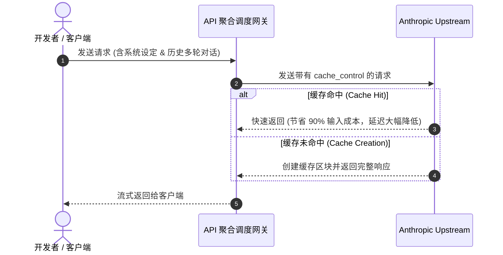

# Claude Prompt Caching 省钱与提速实战

在长上下文（Long Context）的大模型交互中，**输入 Token 往往占据了 80% 以上的 API 费用**。Anthropic 推出的 **Prompt Caching（提示词缓存）** 技术能够将命中缓存的输入 Token 成本降低多达 **90%**，同时显著降低响应首字延迟（TTFT）。



## 1. 核心原理与门槛要求

- **最小 Token 阈值**：Claude 3.5 Sonnet / 3.7 Sonnet 要求单次需要缓存的内容至少达到 **1,024 Tokens**（Opus 要求 2,048 Tokens）。
- **缓存有效期**：默认存活时间为 **5 分钟**。每次请求命中缓存后，TTL 会自动顺延 5 分钟。

## 2. 代码配置实战

在请求体结构中，只需在希望被缓存的文本块末尾声明 `cache_control: { type: "ephemeral" }`：

```json
{
  "model": "claude-3-7-sonnet-20250219",
  "max_tokens": 1024,
  "system": [
    {
      "type": "text",
      "text": "你是一个严谨的资深架构师... (此处放置几千字的核心项目规范与知识库)",
      "cache_control": { "type": "ephemeral" }
    }
  ],
  "messages": [
    {
      "role": "user",
      "content": "请分析当前模块的代码质量。"
    }
  ]
}
```

## 3. 计费对比与经济效益

| Token 计费项 | 标准单价 (per MTok) | 缓存优惠价 (per MTok) | 成本节省比例 |
| :--- | :--- | :--- | :--- |
| **首次写入 (Cache Creation)** | $3.75 | $3.75 (按标准价 + 25%) | - |
| **后续读取 (Cache Read)** | $3.00 | **$0.30** | **90% 🔻** |
| **生成输出 (Output Tokens)** | $15.00 | $15.00 | 维持原价 |

对于高频次交互的 Coding Agent（如 Claude Code / Cursor），合理规划 Prompt Cache 可以在大规模使用中每个月节省数百至上千美元的 API 支出。
