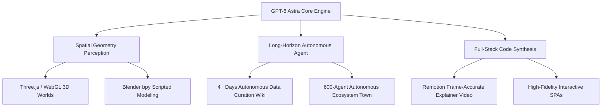

# 🚀 GPT-6 Astra Virtual Creation Guide: Hands-on Recreation of 3D Worlds, Blender Landmarks & Personal Wiki

:::info Overview
In the evolution of AI, the leap from simple text conversations and basic code completions to **spatial geometry construction and long-horizon autonomous creation** marks a watershed moment for next-generation intelligence.
OpenAI's latest model, **GPT-6 Astra**, demonstrates breakthrough performance in 3D spatial perception (BenchCAD 90.9%), full-stack code synthesis (SWE 74.1%), and autonomous long-running agents.

This guide dissects the underlying engineering workflows and spatial construction paradigms of next-generation models. It provides **step-by-step, zero-threshold, reproducible tutorials** for four flagship projects: **Interactive 3D Little Planet**, **Blender Scripted Landmark Reconstruction**, **Remotion Code-Driven Explainer Video**, and a **Long-running Autonomous Personal AI Wiki**.
:::

---

## 1. GPT-6 Astra Core Breakthroughs & Benchmarks

Compared with prior models, GPT-6 Astra elevates AI from a passive textual assistant to a proactive virtual creator driven by **Spatial Intelligence** and **Code as Canvas**.



### Key Performance Benchmarks
- **Automation Benchmark**: Surged from 18.1% to **44.4%**.
- **Real-World Software Engineering (SWE-bench / DepSwing)**: Reached **74.1%**, surpassing Claude 3.5/3.7 Sonnet and Gemini flagships.
- **Abstract Reasoning (ARC-AGI-2)**: Scored **99.9%** (near perfect, compared to human average of ~44%).
- **3D Modeling & Spatial Awareness (BenchCAD)**: Achieved **90.9%** geometric completeness, beating previous models by over 10 percentage points.

---

## 2. Hands-on Reproduction Tutorials

You don't need closed access to begin. Using the configured system prompts and standard toolchains below, you can reproduce these projects on your local machine today.

---

### 🛠️ Project 1: Browser 3D "Little Planet" with Radial Gravity

**Deliverable**: A self-contained single HTML file. Double-click to open in Chrome/Edge. Explore a spherical planet with WASD keys, jump with Space, experience realistic radial gravity towards the planet center, and trigger wading damping when entering water.

#### Prompt Template
```markdown
You are a world-class Three.js game engine architect. Write a complete, self-contained single-file HTML page that implements an interactive "3D Little Planet" demo runnable directly in modern browsers.

[Requirements]
1. Dependencies: Use official public CDNs for Three.js and OrbitControls. Do not use local module imports.
2. Scene Elements:
   - Planet: Centered at (0,0,0) with radius 20, using green low-poly aesthetic material.
   - Terrain details: Procedurally place 30 low-poly trees (brown cylinder trunk + green cone foliage) and several shallow blue transparent water basins.
   - Atmosphere: Dark starry space background (Points), gentle ambient lighting, and a directional sun casting soft shadows.
3. Physics & Controls:
   - Radial Gravity: Gravity must pull towards the planet core (0,0,0) rather than along the negative Y axis.
   - Character Orientation: Align the character's feet with the spherical surface normal:
     `const up = player.position.clone().normalize();`
     `player.quaternion.setFromUnitVectors(new THREE.Vector3(0, 1, 0), up);`
   - Controls: W/S for forward/backward, A/D to rotate heading, Space to jump radially outward.
   - Wading state: Slow down movement speed by 50% when the character steps into water basins.
4. Camera:
   - Smooth third-person follow camera positioned behind and above the character.
5. Code output:
   - Return the entire, production-ready HTML code without any placeholders or omitted sections.
```

#### How to Run
1. Create `planet.html` on your desktop.
2. Paste the generated code and save.
3. Double-click `planet.html` in your browser. Click into the canvas and explore using WASD and Space!

---

### 🏛️ Project 2: Procedural Palace of Fine Arts via Blender Python (`bpy`)

**Deliverable**: A Python script executed inside Blender 4.x that automatically constructs the iconic Roman rotunda, colonnade arc, water reflecting pool, and golden hour lighting in seconds.

#### Prompt Template
```markdown
You are a senior 3D algorithmic engineer specializing in Blender's Python API (bpy).
Write a clean, self-contained Python script to be executed in Blender 4.x's Scripting workspace.
Goal: Procedurally construct the core architecture of the Palace of Fine Arts in San Francisco.

[Requirements]
1. Environment Reset: Clear all existing default meshes, cameras, and lights.
2. Architecture Geometry:
   - Rotunda: A classical hemispherical Roman dome supported by layered circular entablature rings.
   - Colonnade (Peristyle): 16 majestic Corinthian columns evenly distributed along an arc with radius R=18, each featuring pedestals and decorative capitals.
   - Continuous Entablature: A curved overhead beam uniting the colonnade.
3. Reflecting Pool & Materials:
   - A large reflecting water plane in front of the rotunda.
   - Water material: Low roughness (0.02), high specular reflection.
   - Stone material: Warm sandstone/limestone tone (Roughness 0.7).
4. Lighting & Composition:
   - Golden-hour sun light tilted at 45 degrees (warm amber hue, strength 4.0).
   - Camera positioned near the water's edge looking up dramatically at the dome, designated as active camera (`scene.camera`).
5. Compatibility:
   - Follow Blender 4.x API standards without deprecated shader socket connections.
```

#### How to Run
1. Open **Blender 4.x** and switch to the **Scripting** tab.
2. Click **New**, paste the script, and press **Run Script (▶)**.
3. Press Numpad **0** for camera view, then press **Z** and choose **Rendered** to view the scene.

---

### 🎬 Project 3: 1-Minute Code-Driven Educational Video (Remotion)

**Deliverable**: A 60-second animated explainer video built entirely with React and Remotion, eliminating audio-video drift through deterministic frame interpolation.

#### Setup & Prompt
1. Initialize a Remotion project:
   ```bash
   npx create-video@latest my-ai-video
   cd my-ai-video && npm start
   ```
2. Feed this prompt to GPT-6 / Claude:
   ```markdown
   You are an expert Remotion motion design engineer.
   Write a 60-second educational video component (1920x1080, 30fps, 1800 total frames).
   Theme: "How Average Professionals Save 2 Hours Daily Using AI Agents"

   Timeline Breakdown:
   - Frames 0~300 (0~10s): Information overload pain point with vibrating red alert cards ("99+ unread emails", "urgent reports").
   - Frames 301~900 (10~30s): Clean modern dashboard appears; an "Agent" badge smoothly sorts chaos cards into organized buckets.
   - Frames 901~1500 (30~50s): Dynamic bar chart comparison: Manual processing (120 min) vs AI agent (5 min) with counting numbers.
   - Frames 1501~1800 (50~60s): Call to action takeaway: "Delegate repetition to compute; keep creativity for humans."

   Use Remotion's spring, interpolate, and useCurrentFrame hooks for fluid transitions. Output a complete TSX file for Composition.tsx.
   ```
3. Export high-res video:
   ```bash
   npx remotion render src/index.ts MyVideo out/explainer.mp4
   ```

---

### 🧠 Project 4: Autonomous Personal AI Wiki

**Deliverable**: A local daemon script that analyzes fragmented notes, builds an Obsidian-compatible bi-directional knowledge base (`[[Wikilinks]]`), and produces daily morning briefings predicting emerging interests and blind spots.

#### Lightweight Daemon (`sync_wiki.py`)
```python
import os
import glob
from openai import OpenAI

client = OpenAI(api_key=os.environ.get("OPENAI_API_KEY"))

RAW_DIR = "./raw_notes"
WIKI_DIR = "./wiki_pages"
os.makedirs(WIKI_DIR, exist_ok=True)

raw_content = ""
for file_path in glob.glob(f"{RAW_DIR}/*.txt") + glob.glob(f"{RAW_DIR}/*.md"):
    with open(file_path, "r", encoding="utf-8") as f:
        raw_content += f"\n--- Source: {os.path.basename(file_path)} ---\n" + f.read()

prompt = f"""
You are a lifelong knowledge architect. Analyze the user's unstructured notes:
{raw_content}

Tasks:
1. Extract core knowledge entities (people, projects, concepts). Write dedicated summaries with extensive [[Wikilinks]] cross-referencing.
2. Generate Daily_Insights.md identifying cognitive blind spots and predicting 3 high-leverage next steps based on historical patterns.

Format:
===FILE: Daily_Insights.md===
(Content)
===FILE: [EntityName].md===
(Content)
"""

response = client.chat.completions.create(
    model="gpt-4o",
    messages=[{"role": "user", "content": prompt}],
    temperature=0.3
)

sections = response.choices[0].message.content.split("===FILE: ")
for section in sections[1:]:
    file_name, file_body = section.split("===\n", 1)
    with open(os.path.join(WIKI_DIR, file_name.strip()), "w", encoding="utf-8") as out_f:
        out_f.write(file_body.strip())

print("Wiki updated successfully!")
```

---

## 3. Key Takeaways

The fundamental shift demonstrated by GPT-6 is that **the cost of generating complex code, 3D geometry, and long-running autonomous workflows is converging toward zero**. 

The developer's role is evolving from manual code writing to **system architecture specification and prompt orchestration**. By mastering these patterns, you can build virtual worlds and autonomous cognitive engines on demand.
