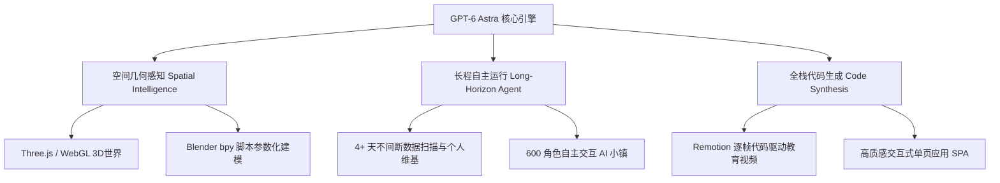

# 🚀 GPT-6 Astra 虚拟造物实战指南：手把手复现 3D 虚拟世界、Blender 建筑与个人维基

:::info 导读
在 AI 发展历程中，从单纯的“文本对话、代码补全”跃迁到“空间几何构建与长程自主造物”，是下一代智能系统的核心分水岭。
近期 OpenAI 最新模型 **GPT-6 Astra** 发布，展示了在 3D 空间感知（BenchCAD 90.9%）、代码全栈合成（SWE 74.1%）以及长程任务（Long-running Agent）上的突破性表现。

本文基于行业前沿评测与 8 个极具代表性的真实应用案例，深入拆解其底层工程链路，并针对**「3D 可漫游小星球」**、**「Blender 脚本化地标重建」**、**「Remotion 代码化动效短视频」**、**「持续自主个人 AI 维基」** 4 个典型场景，提供**保姆级、无删减、零门槛手把手可复现的实操教程**。
:::

---

## 一、GPT-6 Astra 核心能力跃迁与基准测试

与以往的大模型相比，GPT-6 Astra 不仅在传统推理上跑分更高，更核心的突破在于**多模态空间智能（Spatial Intelligence）** 与 **代码级造物（Code as Canvas）**。



### 关键性能指标概览
- **自动化与工作流基准（Automation Benchmark）**：从上一代的 18.1% 大幅跃升至 **44.4%**。
- **真实软件工程能力（SWE-bench / DepSwing）**：达到 **74.1%**，超越 Claude 3.5/3.7 与 Gemini 旗舰，是目前工程代码生成综合能力最顶尖的模型之一。
- **复杂抽象推理（ARC-AGI-2）**：取得接近满分的 **99.9%**（普通人类受试者均值约 44%）。
- **3D 建模与空间感知（BenchCAD）**：空间几何绝对饱合度达 **90.9%**，相比传统模型高出 10+ 个百分点。

---

## 二、视频中揭晓的 8 个核心真实应用案例

| 序号 | 案例名称 | 核心创造者 | 技术实现路径 | 最终形态与亮点 |
| :--- | :--- | :--- | :--- | :--- |
| **01** | **2030 AI接管工作交互网站** | 独立开发者 | React + Tailwind + Framer Motion | 仅凭一句话提示词，生成带角色切换、时间轴与任务接管抽屉的高质感 SPA |
| **02** | **1分钟全流程中文教育动画** | 视频创作者 | 代码驱动动效 (Remotion) + TTS 语音合成 | 10分钟内生成无穿帮、逻辑清晰、带动态图表与分镜的教育短视频 |
| **03** | **微缩可交互小星球 (Little Planet)** | Matthew Berman | WebGL / Three.js + 径向重力物理 | 浏览器可控 3D 小人漫游，涉水时具备逼真阻尼动作与水面波纹 |
| **04** | **3D 模拟城市 (New Haven)** | Matthew Berman | Three.js + A* 寻路 + InstancedMesh | 划分住宅、商业、工业区，具备自主行动的行人和车辆，支持用户动态放置建筑 |
| **05** | **亚历山大图书馆沉浸式漫游** | Ethan Mollick (沃顿商学院) | Three.js 场景 + 空间坐标触发器 + 实时讲解语音 | 重现公元前 250 年古典图书馆，漫游时随行 AI 导师提供实时流式历史解说 |
| **06** | **全量“个人 AI 维基百科”** | Ethan Mollick | 连续运行 4 天 21 小时的 Agent + 双链 Markdown | 深度消化数万封邮件与手稿，建立个人知识网络，每日两次预测兴趣盲区 |
| **07** | **600 个 AI 自主生态小镇** | Matt Shumer | ECS 架构 + 局部通信网格 + 具身智能 | 600 个具身 AI 自主维持生存、寻找资源并在街头相遇时自发对话 |
| **08** | **Blender 重建旧金山艺术宫** | Sharif Shameem | Blender Python API (`bpy`) 参数化建模 | 一行指令驱动 Blender 构建罗马圆顶、16 根科林斯柱廊与倒影水池 |

---

## 三、手把手实操复现指南（可直接运行）

不需要等待复杂的 API 审批，通过以下配置好的**精准 Prompt 工程架构与标准化工具链**，你现在就可以在本地电脑上一一复现这 4 大代表性项目。

---

### 🛠️ 实战 1：制作浏览器 3D 可漫游“小星球”（Little Planet）

**目标**：生成一个单文件 HTML，双击即可在任何现代浏览器中打开。生成一个 3D 悬浮球形星球，玩家可以通过 **W/S/A/D** 控制小人在星球表面奔跑、跳跃，人物身体永远垂直于球心地表（球面重力），走入水池时自动减速。

#### 1. 复制给大模型的 Prompt 咒语
```markdown
你是一名世界顶级的 Three.js 游戏引擎专家。请为我编写一个【单文件完整 HTML 页面】，实现一个可以在浏览器中直接运行的“3D 小星球漫游”演示。

【技术与架构要求】
1. 依赖引入：全部通过公共 CDN 引入 Three.js 和 OrbitControls，不要使用本地 import。
2. 场景构成：
   - 星球本体：中心在 (0,0,0) 的球体（半径 20），赋予绿色低面体（Low-Poly）材质。
   - 地貌细节：在星球表面随机生成 30 棵简单的 Low-Poly 小树（棕色圆柱树干 + 绿色圆锥树冠），以及若干处淡蓝色半透明水洼凹地。
   - 光照与天空：深色太空背景带点点繁星（Points），包含柔和环境光与一盏产生立体阴影的平行日光。
3. 核心物理（关键算法）：
   - 径向重力（Radial Gravity）：重力方向始终从角色当前坐标指向球心 (0,0,0)。
   - 角色姿态对齐：角色的“脚底”必须实时与球体法线对齐（即角色朝向始终垂直于切平面）：
     `const up = player.position.clone().normalize();`
     `player.quaternion.setFromUnitVectors(new THREE.Vector3(0, 1, 0), up);`
   - 控制方式：键盘 W/S 前进/后退，A/D 旋转左右朝向，Space 沿径向外跳跃。
   - 涉水状态：当角色进入低洼水体区域（距离球心小于阈值）时，移动速度自动降低 50%。
4. 摄像机系统：
   - 实现第三人称追尾跟随相机（Follow Camera），平滑跟随在角色斜后上方。
5. 代码格式：
   - 请输出完整的、自包含的 HTML 代码（包含 <!DOCTYPE html>, CSS 样式, JavaScript 逻辑），没有任何省略或待补充注释。
```

#### 2. 本地运行步骤
1. 在桌面新建一个文本文件，将其命名为 `planet.html`。
2. 将模型生成的 HTML 代码完整复制进去并保存。
3. **直接双击 `planet.html`**，页面将在 Chrome/Edge 中瞬间启动。点击画面即可用 WASD 操控畅游！

---

### 🏛️ 实战 2：用 Blender Python 脚本重建“旧金山艺术宫”

**目标**：无需手动拉点线面建模。在免费 3D 软件 **Blender** 中粘贴一段 Python 脚本，按下运行，数十秒内自动建立罗马式巨型穹顶、科林斯立柱回廊、倒影水池与黄昏暖阳。

#### 1. 软件环境准备
- 下载并打开 **Blender 4.x**（官网 blender.org 免费下载）。
- 顶部导航栏点击切换到 **Scripting（脚本工作区）**。
- 点击编辑区上方的 **New（新建）** 按钮。

#### 2. 复制给大模型的 Prompt 咒语
```markdown
你是一名精通 Blender Python API (bpy) 的资深 3D 算法工程师。请为我编写一段可以直接在 Blender 4.x Scripting 窗口中运行的 Python 脚本。
任务：通过参数化数学建模，自动重建“旧金山艺术宫（Palace of Fine Arts）”的标志性核心建筑。

【具体实现要求】
1. 环境清理：脚本开头自动选中并删除场景中原有的 Default Cube、Camera、Light。
2. 核心建筑结构：
   - 巨型圆顶（Rotunda）：在中心生成一个经典的罗马半球形穹顶，下方带有分层环形横梁支撑。
   - 弧形柱廊（Peristyle）：以半径 R=18 的圆弧环绕排列 16 根宏伟立柱，每根立柱包含方形基座、圆柱柱身以及简易柱头装饰。
   - 顶部雕带檐口（Entablature）：柱廊上方有一圈连续的环形厚实横梁。
3. 地面与倒影水池：
   - 在建筑前方生成一个平整的大型水面网格。
   - 为水体赋予高反射、低粗糙度的水面材质（Principled BSDF: Roughness=0.02, Base Color 偏青灰）。
   - 为石柱与穹顶赋予砂岩材质（温和的米黄色，Roughness=0.7）。
4. 构图与光影：
   - 自动生成一个 Sun Light（日光），角度为 45 度斜照的低角度暖色夕阳（Color 偏暖橙，Strength=4.0）。
   - 自动创建一台摄像机，摆放在水池边缘低角度仰拍艺术宫穹顶，并设置为主摄像机（scene.camera）。
5. 脚本稳健性：
   - 兼容 Blender 4.0+ API，避免使用废弃的材质连接语法。
```

#### 3. 运行与渲染
1. 将生成的 Python 代码完整粘贴到 Blender 的脚本区。
2. 点击上方的 **▶（运行脚本）** 按钮。
3. 按小键盘 **0** 进入相机视角，按 **Z** 键并在轮盘中选择 **Rendered（渲染视图）**，即可看到逼真的艺术宫殿日落景象。

---

### 🎬 实战 3：用 Remotion 代码制作 1 分钟教育短视频

**目标**：放弃剪映手工调针，使用 React 代码精准控制每一帧的动画与图表，由代码引擎一键渲染高清 MP4。

#### 1. 本地脚手架初始化
在电脑命令行（Terminal / PowerShell）中运行：
```bash
npx create-video@latest my-ai-video
# 模板选择：React + TypeScript
cd my-ai-video
npm start
```

#### 2. 复制给大模型的 Prompt 咒语
```markdown
你是一名精通 Remotion (React for Video) 的动效工程师。
请帮我编写一个 60 秒的横屏教育视频组件（1920x1080，30fps，总帧数 1800 帧）。
【视频主题】：《普通人如何用 AI Agent 每天省下 2 小时》

【分镜时间轴规划】
1. 第 0~300 帧（0~10秒）痛点引入：
   - 标题：“信息过载的一天”，屏幕中央动态弹入“未读邮件 99+”、“紧急报表”等浮动红色卡片，伴随微小抖动特效。
2. 第 301~900 帧（10~30秒）解决方案演示：
   - 画面切换为清爽现代浅色工作台。
   - 一个名为“Agent”的发光徽标，自动将杂乱卡片平滑吸附归类到【优先处理】、【会议通知】两个收纳盒中。
3. 第 901~1500 帧（30~50秒）数据对比柱状图：
   - 动态升起的对比柱状图：人工处理（耗时 120 分钟） vs AI 托管（耗时 5 分钟），带数字递增滚动效果。
4. 第 1501~1800 帧（50~60秒）结尾总结：
   - 总结文字：“把重复劳动留给算力，把创造力留给自己”。

【技术要求】
- 使用 Remotion 内置的 `spring`、`interpolate` 和 `useCurrentFrame` 实现丝滑缓动动画。
- 使用极简高级的现代深色/扁平卡片设计风格。
- 请直接输出单个完整的 TSX 组件代码（覆盖 Composition.tsx）。
```

#### 3. 渲染导出
将代码粘贴进 `src/Composition.tsx` 后在浏览器中预览。确认满意后，在终端执行以下命令，几秒钟即可导出 MP4 视频：
```bash
npx remotion render src/index.ts MyVideo out/explainer.mp4
```

---

### 🧠 实战 4：搭建持续自主运行的“个人 AI 维基”（Personal Wiki）

**目标**：复现 Andrej Karpathy 与 Ethan Mollick 的知识引擎。让脚本自动扫描碎片笔记与灵感，用大模型梳理出带有 **`[[双向链接]]`** 的网状知识库，并在每天早晨生成一份**“未来兴趣预测与认知盲区简报”**。

#### 1. 环境准备
- 下载安装免费笔记工具 **Obsidian**（obsidian.md）。
- 新建一个库命名为 `SecondBrain`，在其中创建文件夹 `raw_notes`（放入平时的杂乱笔记）与 `wiki_pages`。

#### 2. 轻量化 Python 同步脚本 (`sync_wiki.py`)
在 Obsidian 库的根目录下保存以下脚本：

```python
# sync_wiki.py
import os
import glob
from openai import OpenAI

# 确保环境变量设置了 OPENAI_API_KEY
client = OpenAI(api_key=os.environ.get("OPENAI_API_KEY"))

RAW_DIR = "./raw_notes"
WIKI_DIR = "./wiki_pages"
os.makedirs(WIKI_DIR, exist_ok=True)

# 1. 聚合读取所有散乱的 Markdown / TXT 笔记
raw_content = ""
for file_path in glob.glob(f"{RAW_DIR}/*.txt") + glob.glob(f"{RAW_DIR}/*.md"):
    with open(file_path, "r", encoding="utf-8") as f:
        raw_content += f"\n--- 来源文件: {os.path.basename(file_path)} ---\n" + f.read()

if not raw_content.strip():
    print("请先在 raw_notes 文件夹中放入一些零散笔记或日记文件！")
    exit()

prompt = f"""
你是一名终身知识架构师。以下是用户最近积累的零碎随笔与工作记录：
{raw_content}

请执行两个核心任务：
1. 提炼核心知识实体：提取人物、核心项目、学术/商业概念。为每个核心实体编写独立页面，并且**必须密集使用 Obsidian 风格的双向链接 [[概念名称]]** 互相勾连！
2. 每日认知盲区简报（Daily_Insights.md）：根据用户近期记录，推测用户思维中可能忽略的盲区，并基于过往历史轨迹推荐 3 个最具潜力的下一步行动方向。

输出格式必须严格遵循分块标记：
===FILE: Daily_Insights.md===
(内容)
===FILE: [实体名称1].md===
(内容)
"""

print("正在调用大模型分析知识网络...")
response = client.chat.completions.create(
    model="gpt-4o",  # 若具备 GPT-6 或推理模型权限可替换为对应代号
    messages=[{"role": "user", "content": prompt}],
    temperature=0.3
)

output_text = response.choices[0].message.content

# 2. 自动化解析并保存为独立的双链 Markdown 页面
sections = output_text.split("===FILE: ")
for section in sections[1:]:
    file_name, file_body = section.split("===\n", 1)
    target_path = os.path.join(WIKI_DIR, file_name.strip())
    with open(target_path, "w", encoding="utf-8") as out_f:
        out_f.write(file_body.strip())

print(f"✅ 维基库重构完成！页面已同步至 {WIKI_DIR}")
```

#### 3. 查看神经图谱
1. 运行 `python sync_wiki.py`。
2. 打开 Obsidian，点击左侧边栏的 **关系图谱（Graph View）**。
3. 瞬间，零散的碎片笔记被整理成一个以 `[[实体]]` 紧密相连的星系状知识图谱；打开 `Daily_Insights.md`，即可看到 AI 站在上帝视角为你推演的深度洞察！

---

## 四、高手调优大模型的 3 大提示词心法

1. **“以代码为载体”代替“空泛描述”**：
   不要问“旧金山艺术宫有哪些建筑特点”，而是让它“用 Blender `bpy` 绘制 16 根环形立柱”。把需求落实到坐标、材质参数和函数调用，模型的幻觉会降到最低。
2. **锁死“单文件自包含（Self-Contained）”**：
   对前端与 3D 原型，要求“全量代码写在一个 HTML 内，依赖使用公共 CDN 绝对链接”。这能最大程度避免模块导入路径错误，方便快速双击验证。
3. **建立“报错反馈闭环”**：
   遇到控制台红字报错，不要人工猜错。直接将报错栈复制给模型，并附带：“*在执行上述代码时抛出该错误，请结合上下文定位问题并给出修正后的完整代码*”。

---

## 五、结语

在以 GPT-6 为代表的新一代 AI 时代，**技术门槛正在从“如何写代码/如何拉模型”转移到“如何定义系统的物理边界与业务架构”**。

无论是一个可在指尖转动的 3D 微缩世界，还是一座由代码瞬间拔地而起的宏伟艺术殿堂，亦或是一套能够自主反思生长的个人数字大脑——只要你掌握了“架构思维 + 提示词工程”，造物的钥匙就已经在你手中。
