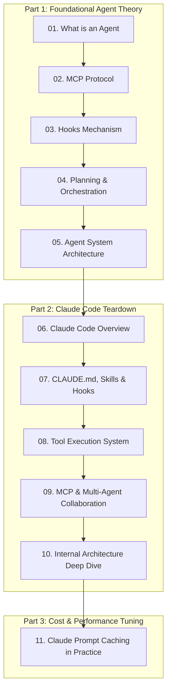

# 🤖 AI & Agent Architecture & Practices

:::info Overview
A comprehensive technical breakdown covering foundational Agent theories (MCP, Hooks, Planning) to deep dive architecture teardowns of **Claude Code** and autonomous multi-agent collaboration.
:::

---

## 📚 Part 1: Agent Fundamentals & Protocols

- [01. What is an AI Agent?](/en-US/ai/what-is-agent)
- [02. Understanding Model Context Protocol (MCP)](/en-US/ai/what-is-mcp)
- [03. Lifecycle Hooks in Agent Systems](/en-US/ai/what-is-hooks)
- [04. Planning & Orchestration Mechanisms](/en-US/ai/planning-and-orchestration)
- [05. The Grand Architecture of Agent Systems](/en-US/ai/agent-system-overview)

---

## 🛠️ Part 2: Claude Code Internal Architecture

- [06. Claude Code: High-Level Overview & Philosophy](/en-US/ai/claude-code-overview)
- [07. CLAUDE.md, Custom Skills & Hooks](/en-US/ai/claude-code-skills-hooks)
- [08. The Tool Execution Subsystem](/en-US/ai/claude-code-tool-system)
- [09. MCP & Multi-Agent Collaborative Workflows](/en-US/ai/claude-code-mcp-multi-agent)
- [10. Inside Claude Code: Architectural Execution Pipeline](/en-US/ai/claude-code-internal-architecture)

---

## ⚡ Part 3: Cost & Performance Optimization

- [11. Optimizing Claude API with Prompt Caching](/en-US/ai/claude-prompt-caching)
