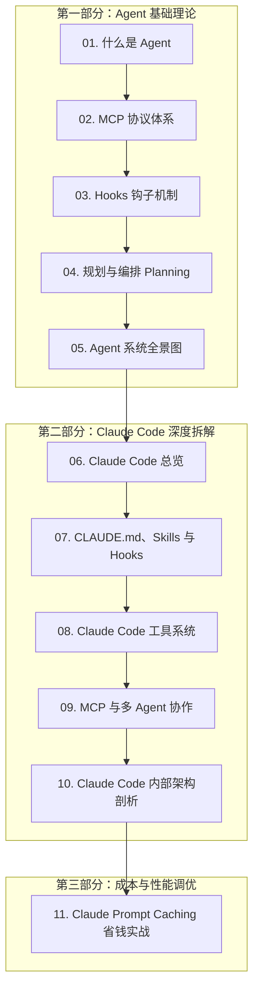

# 🤖 AI & Agent 实战与架构深度指南

:::info 专栏说明
本板块系统梳理从 **Agent 核心原理、MCP 协议、Hooks 机制** 到 **Claude Code 内部架构、多 Agent 协作** 的完整知识脉络与实战经验。
:::

> 📖 **微信公众号合集**：[深入浅出 Agent 架构与 Claude Code 实战专栏](https://mp.weixin.qq.com/mp/appmsgalbum?__biz=Mzk0NzYxMDM0Mw==&action=getalbum&album_id=4525764068095410183#wechat_redirect)

---

## 📚 第一部分：Agent 原理与核心机制

- [01. 什么是 Agent（智能体基础认知）](/ai/what-is-agent)
- [02. 什么是 MCP（Model Context Protocol 上下文协议）](/ai/what-is-mcp)
- [03. 什么是 Hooks（生命周期钩子机制）](/ai/what-is-hooks)
- [04. 什么是规划与编排（Planning & Orchestration）](/ai/planning-and-orchestration)
- [05. Agent 系统全景架构图](/ai/agent-system-overview)

---

## 🛠️ 第二部分：Claude Code 内部架构与实战

- [06. Claude Code 总览与设计哲学](/ai/claude-code-overview)
- [07. CLAUDE.md、Skills 与 Hooks 实操](/ai/claude-code-skills-hooks)
- [08. Claude Code 工具系统（Tool Use 进阶）](/ai/claude-code-tool-system)
- [09. Claude Code MCP 与多 Agent 协同](/ai/claude-code-mcp-multi-agent)
- [10. Claude Code 内部架构剖析与执行链路](/ai/claude-code-internal-architecture)

---

## ⚡ 第三部分：成本与性能优化

- [11. Claude Prompt Caching 省钱与提速实战](/ai/claude-prompt-caching)
