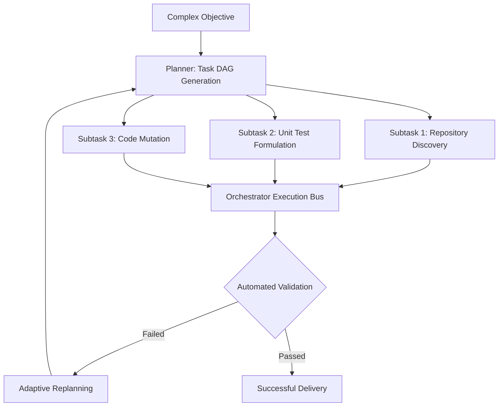

# Planning & Orchestration in Autonomous Systems

For complex multi-step engineering initiatives (e.g., refactoring backend modules, tracing distributed deadlocks), single-turn inference is insufficient. **Planning & Orchestration** defines the boundary between basic chatbots and production-ready agents.

## 1. Classical Planning Paradigms

1. **ReAct Loop (Reasoning + Acting)**:
   - Dynamic single-step feedback loop: *Thought $\rightarrow$ Action $\rightarrow$ Observation*. Excellent for local exploration, but susceptible to drift on complex projects.
2. **Plan-and-Solve**:
   - Decomposes the global objective into an explicit Directed Acyclic Graph (DAG) prior to execution, maintaining high structural alignment.
3. **Hierarchical Multi-Agent Orchestration**:
   - A Lead Agent evaluates goals and delegates targeted sub-tasks to specialized domain workers (Coders, Reviewers, Pen-testers), synchronizing results via a stateful blackboard.
