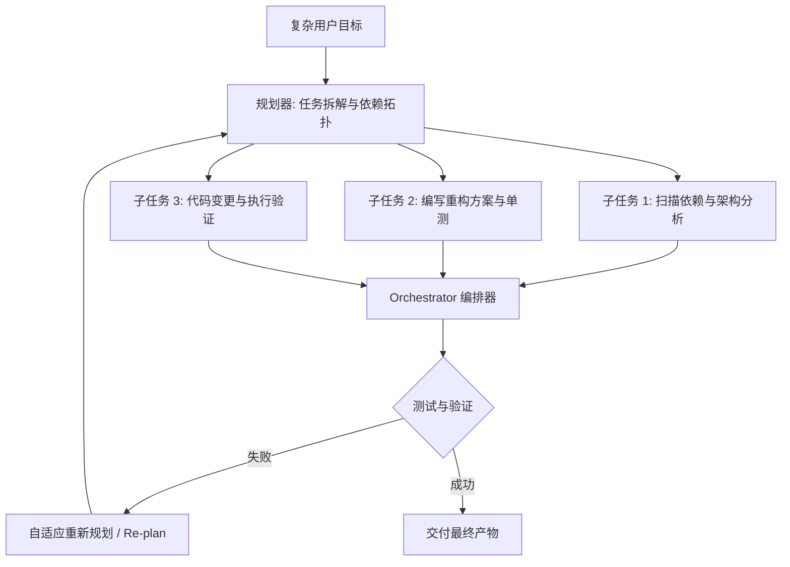

# 什么是规划与编排（Planning & Orchestration）

面对复杂的工程研发需求（如“重构一个微服务模块”或“排查分布式死锁”），单次模型推理无法直接达成目标。**规划（Planning）与编排（Orchestration）** 决定了 Agent 处理复杂长链任务的上限。

## 1. 核心规划模式对比

1. **ReAct（Reasoning + Acting）**：
   - 经典模式：思考（Thought） $\rightarrow$ 行动（Action） $\rightarrow$ 观察（Observation）的循环。
   - 优点：反应迅速、灵活性高；缺点：容易在长任务中迷失大局方向。
2. **Plan-and-Solve（先规划后执行）**：
   - 第一阶段生成宏观执行 DAG 图（有向无环图），第二阶段按依赖逐步执行。
   - 优点：大局观清晰、结构严密；缺点：遇到未预期的环境变化时需要重规划（Re-planning）。
3. **Multi-Agent Hierarchical（层级多 Agent 协作）**：
   - 主管 Agent（Tech Lead）负责全局拆解并派发任务给专业 Worker Agent（Code Writer、Tester、Reviewer），由编排器负责汇总结果。

---

> 🔗 **微信公众号原文**：[什么是规划与编排（Planning & Orchestration）](http://mp.weixin.qq.com/s?__biz=Mzk0NzYxMDM0Mw==&mid=2247484233&idx=1&sn=813d49191671f2be05d75fa0166f1ab3)
