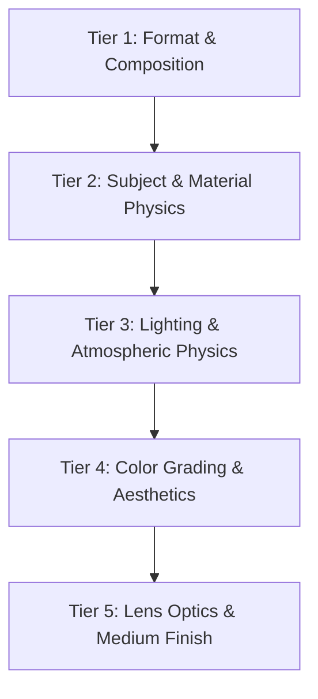

# 🎨 Production-Grade Prompt Engineering for Generative Vision (DALL-E 3 & Flux)

:::info Overview
As AI vision synthesis evolves from random experimentation into industrial pipelines, loose keyword stacking no longer meets commercial benchmarks. Based on community insights (such as `awesome-gpt-image-2`) and real-world production cases, this guide deconstructs the **five-tier structural prompt architecture** for high-fidelity generative imagery.

👉 **Hands-On Tool**: Test every prompt formula in this article inside our dedicated [🧰 Online Toolbox · AI Image Studio](/en-US/tools/image-studio).
:::

---

## 1. Why Keyword Stacking Fails in Modern Diffusion Models

In early text-to-image models (Stable Diffusion 1.5, Midjourney v4), prompt tags were often piled together:
> ❌ **Outdated Pattern**:  
> `1girl, beautiful, ultra-detailed, 8k, masterpiece, anime, high quality, trending on artstation, unreal engine 5, photorealistic`

Modern models (OpenAI DALL-E 3, Flux.1, Midjourney v6) use deep **LLM-based text encoders (e.g., T5-XXL / Multimodal LLMs)** capable of understanding contextual semantics:
1. **Semantic Conflict**: Combining `photorealistic` with `anime` causes style fragmentation.
2. **Quality Bias Penalty**: Words like `masterpiece` or `trending on artstation` are treated as noise by de-biased alignment models.
3. **Spatial Ignorance**: Pure comma-separated tags cannot define composition, light source angles, or depth planes.

---

## 2. The Five-Tier Prompt Pyramid Architecture

Structure your visual prompt using this five-tier blueprint:



### Tier 1: Format & Composition
- **Key Terms**: `exploded view diagram`, `editorial close-up portrait`, `isometric 3D view`, `wide-angle cinematic landscape`.

### Tier 2: Subject & Material Physics
- **Key Terms**: `frosted acrylic`, `brushed titanium`, `matte ceramic`, `subsurface scattering porcelain skin`.

### Tier 3: Lighting & Atmospheric Physics
- **Key Terms**: `directional softbox studio lighting`, `dramatic rim lighting`, `volumetric god rays`, `wet asphalt reflections`.

### Tier 4: Color Grading & Palette
- **Key Terms**: `muted pastel palette`, `monochrome high-contrast deep blacks`, `warm golden hour glow`.

### Tier 5: Lens Optics & Medium Finish
- **Key Terms**: `Hasselblad medium format 80mm lens`, `subtle 35mm film grain`, `Pop Mart vinyl toy aesthetic`.

---

## 3. Real-World Commercial Case Studies

### Case 1: Industrial Hardware Exploded View
```markdown
High-tech exploded view product diagram poster of an ultra-sleek futuristic VR headset. 
Vertically stacked floating component layers: transparent curved visor, micro-OLED optical lenses, 
intricate motherboard circuit chip with glowing cyan traces, compact cooling fan, lithium battery module, 
ergonomic cushioned strap. Clean studio lighting, soft purple and deep blue ambient gradient background, 
technical annotation lines, 8k resolution, cinematic industrial 3D render.
```

### Case 2: Natural Lifestyle Portraiture
```markdown
A photorealistic vertical beach portrait of an attractive young East Asian woman smiling warmly at the camera 
at golden hour sunset, wet shoulder-length dark hair clinging naturally to face. 
Reaching one hand playfully toward the lens throwing sparkling sea water, freezing droplets in mid-air with high-speed shutter. 
Warm cinematic backlighting, natural radiant skin texture, shimmering ocean bokeh, 35mm lifestyle photography aesthetic.
```

### Case 3: 3D Collectible Toy Mascot
```markdown
Cute 3D stylized designer toy avatar of an anime chibi girl, smooth glossy plastic and soft vinyl texture, 
rounded forms, cute dark bob hair with round glasses. Wearing an oversized pastel hoodie and chunky sneakers. 
Standing on a pastel pedestal against a soft neutral studio background, gentle overhead softbox lighting, 
ambient occlusion, Pop Mart collectible aesthetic, Octane 3D render.
```

---

## 4. Try It Hands-On

Turn theory into real assets. Launch our browser-based **[🧰 Online Toolbox · AI Image Studio](/en-US/tools/image-studio)**:
- Zero local setup or GPU configuration required;
- Direct, client-side API requests under the BYOK (Bring Your Own Key) model;
- One-click presets and dynamic aspect ratio switching.
