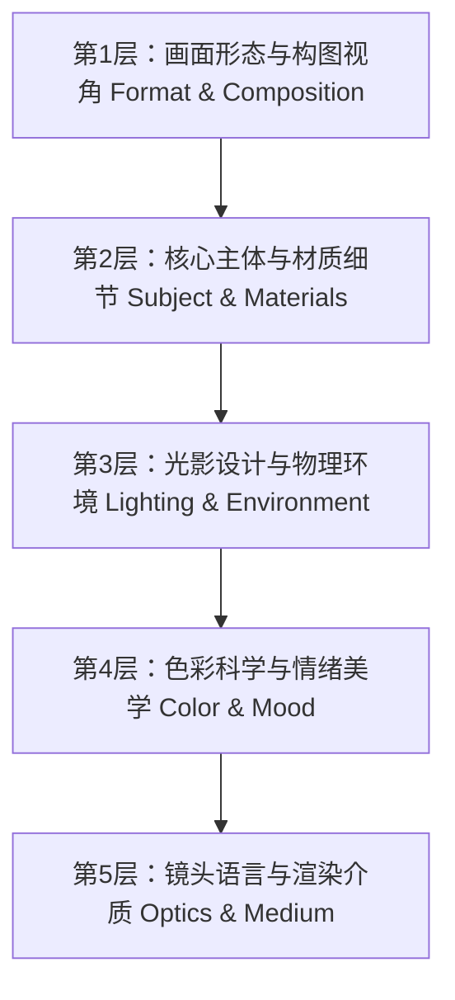

# 🎨 工业级 AI 生图提示词工程实战指南 (DALL-E 3 & Flux)

:::info 导读
在 AI 图像生成从“玩具尝鲜”走向“工业化交付”的今天，靠玄学撞运气随机拼凑单词已无法满足高标准的商业需求。本文基于开源社区前沿经验（如 `awesome-gpt-image-2`）与生产级落地实践，深入拆解 **高可控、高质感、强表现力的 AI 生图提示词组织架构与调优秘籍**。

👉 **配套实战工具**：你可以在独立标签页的 [🧰 在线工具箱 · AI 生图工坊](/tools/image-studio) 实时测试本文所有提示词公式。
:::

---

## 一、为什么传统“单词堆叠法”在现代生图模型中失效？

早期 Midjourney v4 或 Stable Diffusion 1.5 时代，社区流行一种“打标签式”的提示词：
> ❌ **反面教材（低效堆叠）**：  
> `1girl, beautiful, ultra-detailed, 8k, masterpiece, anime, high quality, trending on artstation, unreal engine 5, photorealistic`

现代生图模型（如 OpenAI DALL-E 3、GPT Image 2、Flux.1、Midjourney v6）都深度集成了 **LLM 文本理解编码器（如 T5-XXL 或定制多模态视觉语言模型）**。它们具备强大的自然语言语义解析能力：
1. **语义泛化冲突**：同时写 `photorealistic`（写实）和 `anime`（动漫），模型会陷入风格分裂。
2. **负面污染**：过度使用 `masterpiece`、`trending on artstation` 会被现代去偏置模型当作低质噪音，反而压制画面细节。
3. **空间定位失效**：单词堆叠无法表达“主体在左侧、光从右上角打过来、背景虚化倒影在水面”这种精确的几何与光影视角。

---

## 二、工业级“五层金字塔提示词架构” (Prompt Architecture)

为了让模型精准还原头脑中的构图与细节，推荐采用结构化的五层表达模型：



### 1. 构图与视角 (Format & Composition)
明确定义是平面海报、微距特写、等轴立体还是工业爆炸图。
- **推荐术语**：`exploded view diagram`（立体拆解图）、`editorial close-up portrait`（时尚杂志特写）、`isometric 3D view`（等轴测视角）、`wide-angle landscape`（广角全景）。

### 2. 主体与材质物理特性 (Subject & Materials)
明确描述材质的物理反射率、折射率与触觉细节。
- **推荐术语**：`frosted acrylic`（磨砂亚克力）、`brushed titanium`（拉丝钛合金）、`matte ceramic`（哑光陶瓷）、`subsurface scattering porcelain skin`（次表面散射温润肤质）。

### 3. 光影与物理环境 (Lighting & Environment)
光影是画面的灵魂，指明光源方向、色温和软硬程度。
- **推荐术语**：`directional morning softbox lighting`（柔光箱定向光）、`dramatic rim lighting`（戏剧性轮廓光/边缘光）、`volumetric god rays`（丁达尔效应/体积光）、`wet asphalt neon reflections`（湿沥青漫反射）。

### 4. 色彩美学与调色 (Color Grading)
避免单纯说“colorful”，要指定色调范围。
- **推荐术语**：`muted pastel palette`（低饱和莫兰迪/马卡龙色）、`monochrome high contrast deep blacks`（黑白高对比度）、`warm golden hour grading`（暖调黄昏色系）。

### 5. 镜头与介质语言 (Optics & Medium)
用摄影设备或美术流派锁定最终质感。
- **推荐术语**：`Hasselblad medium format 80mm lens`（哈苏中画幅镜头质感）、`subtle 35mm film grain`（微弱胶片颗粒感）、`Pop Mart vinyl toy aesthetic`（潮玩乙烯基手材质感）。

---

## 三、4 大典型高频商业场景实战范例拆解

### 1. 科技硬件爆炸图 (Hardware Exploded View)
适合数码产品展示、工业设计概念图、科技海报。

```markdown
High-tech exploded view product diagram poster of an ultra-sleek futuristic VR headset. 
Vertically stacked floating component layers: transparent curved visor, micro-OLED optical lenses, 
intricate motherboard circuit chip with glowing cyan traces, compact cooling fan, lithium battery module, 
ergonomic cushioned strap. Clean studio lighting, soft purple and deep blue ambient gradient background, 
technical annotation lines, 8k resolution, cinematic industrial 3D render.
```
- **核心亮点**：通过 `Vertically stacked floating component layers`（垂直悬浮层级）明确触发模型的空间层叠排版能力。

---

### 2. 真实人物生活感抓拍 (Lifestyle Realism)
告别一眼假的“AI 塑料塑料脸”，追求自然的人文与生活气息。

```markdown
A photorealistic vertical beach portrait of an attractive young East Asian woman smiling warmly at the camera 
at golden hour sunset, wet shoulder-length dark hair clinging naturally to face. 
Reaching one hand playfully toward the lens throwing sparkling sea water, freezing droplets in mid-air with high-speed shutter. 
Warm cinematic backlighting, natural radiant skin texture, shimmering ocean bokeh, 35mm lifestyle photography aesthetic.
```
- **核心亮点**：使用 `freezing droplets in mid-air with high-speed shutter`（高速快门水花定格）与 `natural skin texture`，模型会自动保留真实的光学虚化与毛孔细节。

---

### 3. 3D 盲盒 IP 潮玩角色 (Designer Toy / Avatar)
适合制作个人社交头像、品牌吉祥物、App 3D 插画。

```markdown
Cute 3D stylized designer toy avatar of an anime chibi girl, smooth glossy plastic and soft vinyl texture, 
rounded forms, cute dark bob hair with round glasses. Wearing an oversized pastel hoodie and chunky sneakers. 
Standing on a pastel pedestal against a soft neutral studio background, gentle overhead softbox lighting, 
ambient occlusion, Pop Mart collectible aesthetic, Octane 3D render.
```
- **核心亮点**：`ambient occlusion`（环境光遮蔽）加上 `Pop Mart collectible aesthetic` 能赋予模型圆润干净的光影分层。

---

### 4. 新海诚风极具情绪感的动漫插画 (Cinematic Anime)
适合文章配图、壁纸、概念故事板。

```markdown
Makoto Shinkai anime aesthetic landscape illustration. 
Majestic towering summer cumulonimbus thunderhead clouds glowing under radiant golden hour sunset. 
A train passing through a countryside railway crossing with green fields and distant ocean view. 
Luminous lens flares, vibrant saturated colors, nostalgic and poetic atmosphere, ultra-fine anime background art.
```

---

## 四、中英文提示词混用的实战建议

1. **为什么建议主体用英文？**  
   全球主流前沿视觉大模型（DALL-E 3、Flux、Midjourney）的底层训练数据集（LAION 等）超 85% 为英文图文配对。对细微材质（如 `brushed titanium` vs `拉丝钛金属`）和镜头词汇（如 `depth of field` vs `景深`），英文能激发模型更丰富的先验权重。
2. **中文何时最具优势？**  
   国风题材、中国传统美食、地标建筑和中文艺术字体排版，使用中文指令往往比拼音更地道（例如 `成都宽窄巷子`、`九宫格牛油火锅`、`水墨留白`）。
3. **推荐策略**：  
   核心风格描述、镜头光影用英文，专属专有名词用中文，或者直接借助 DALL-E 3 的自动语义扩充（Revised Prompt）机制。

---

## 五、立即上手体验

理论结合实战才能产生生产力。我们在本站独立工具箱提供了开箱即用的 **[🧰 在线工具箱 · AI 生图工坊](/tools/image-studio)**：
- 无需安装 Python、ComfyUI 或下载几十 GB 的显卡模型；
- 填入你现有的 API Key 即可在浏览器端安全调用，零隐私上传；
- 预置上述所有工业级场景公式，一键填入并微调参数。
