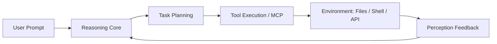

# What is an AI Agent: Foundational Concepts

As Large Language Models (LLMs) evolve from passive conversational interfaces (Chatbots) toward autonomous execution engines, **AI Agents** represent the core paradigm shift in modern computing.

## 1. The Paradigm Shift: LLM vs. Agent

- **Standalone LLM**: An autoregressive token generator predicting probability distributions. Capable of reasoning, but lacks environmental awareness, external side-effects, and persistent state.
- **AI Agent**: An autonomous operational loop powered by an LLM core, integrated with **Perception**, **Planning**, **Action (Tools)**, and **Memory**.

## 2. The Four Pillars of Agent Architecture

1. **Reasoning Core (Brain)**: Evaluates high-level prompts, formulates intent, and decides next actions.
2. **Planning Engine**: Deconstructs macro objectives into sequential sub-tasks with self-correcting feedback loops.
3. **Tool Execution (MCP/Tools)**: Enables interaction with the physical/digital world (file I/O, terminal commands, database querying, external APIs).
4. **Memory Subsystems**:
   - *Working Memory*: Dynamic session context window.
   - *Long-Term Memory*: External knowledge bases via vector search / RAG.
