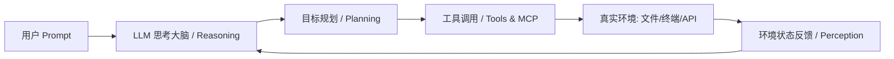

# 什么是 Agent（一）：智能体基础认知

在大模型（LLM）从“聊天对话（Chatbot）”迈向“自主行动（Action）”的浪潮中，**Agent（智能体）** 成为了最核心的演进方向。

## 1. 从 LLM 到 Agent 的本质跃迁

传统的 LLM 交互是一次性的“输入 $\rightarrow$ 输出”黑盒：
- **LLM（大语言模型）**：基于海量文本概率预测下一个 Token，具备常识与推理能力，但没有自主行动权、无法操作外部系统、也没有长期状态。
- **Agent（智能体）**：以大模型为核心大脑，赋予了 **环境感知（Perception）**、**自主规划（Planning）**、**工具执行（Action/Tools）** 和 **记忆机制（Memory）** 的闭环自动化系统。

## 2. Agent 的四大核心要素

1. **核心大脑 (Brain/Reasoning)**：负责理解复杂指令、做意图拆解与下一步动作决策。
2. **规划能力 (Planning)**：将高阶目标拆解为可逐步落地的子任务链，并在执行受挫时自适应调整。
3. **工具系统 (Tools/MCP)**：让模型突破只输出文本的限制，能够读写文件、执行 Bash、调用 RESTful API、查询数据库。
4. **记忆机制 (Memory)**：
   - *短期记忆*：当前上下文窗口内的对话与工具调用轨迹。
   - *长期记忆*：通过向量数据库、本地知识库检索（RAG）召回的历史沉淀。

---

> 🔗 **微信公众号原文**：[什么是 Agent（一）](http://mp.weixin.qq.com/s?__biz=Mzk0NzYxMDM0Mw==&mid=2247484181&idx=1&sn=2a897cbf45477c65c1f99f58b3601b6b)
