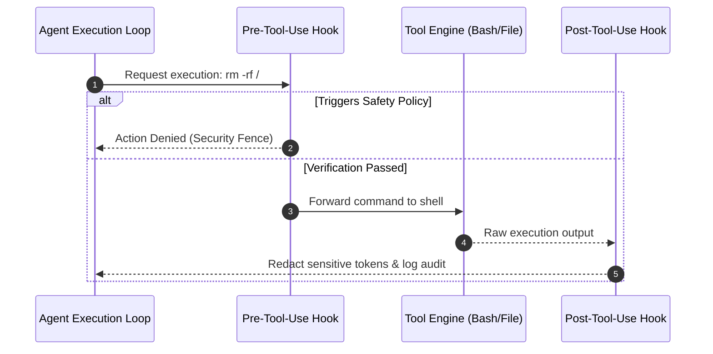

# Lifecycle Hooks in Agent Systems

In production Agent runtimes, **Hooks** provide the essential architectural scaffolding for deterministic guardrails, real-time command interception, observability, and workflow governance.

## 1. Why Runtimes Require Lifecycle Hooks

Unconstrained autonomous LLMs pose real operational risks if granted raw environment capabilities:
- **Security Guardrails**: Enforce strict approval gates before destructive operations (e.g., `DROP TABLE`, destructive Git rebases).
- **Context Hygiene**: Automatically redact API keys, compress massive outputs, and prune context bloat before passing data back into the LLM context window.
- **Observability**: Real-time telemetry on tool latency, token burn, and failure rates.

## 2. Standard Agent Lifecycle Stages

- **`pre_tool_call`**: Permission gates, destructive command fencing, parameter sanitization.
- **`post_tool_call`**: Response truncation, secret redaction, schema translation.
- **`on_session_start`**: Loading project conventions (`CLAUDE.md`), setting environment variables.
- **`on_session_end`**: Generating execution summaries, workspace cleanup.
