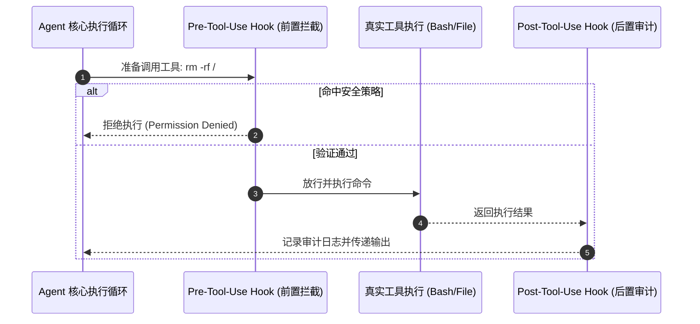

# 什么是 Hooks：生命周期钩子与拦截机制

在现代 Agent 架构中，**Hooks（钩子）** 是实现安全风控、状态拦截、自动化审计以及工作流扩展的核心基础设施。

## 1. 为什么 Agent 需要 Hooks？

大模型自主决策工具调用时具有“不可控性”，直接将操作系统权限交给 Agent 存在极大安全风险：
- **安全拦截与权限护栏**：在执行高危动作（如 `drop database`、`git push --force`）前强制弹出人机确认或直接阻断。
- **上下文自动清洗**：在模型读取超大文件或日志时，通过 Hook 自动截断、脱敏敏感密钥（Redaction）。
- **生命周期指标监控**：统计每次工具调用的延迟、Token 消耗及错误率。

## 2. 常见的 Agent 钩子生命周期

| Hook 类型 | 触发时机 | 典型应用场景 |
| :--- | :--- | :--- |
| **`pre_tool_call`** | 工具执行前 | 命令权限拦截、高危参数校验、环境前置检查 |
| **`post_tool_call`** | 工具执行后 | 输出内容清洗、Token 剪枝、错误重试判定 |
| **`on_agent_start`** | Agent 会话启动 | 自动加载本地环境变量、注入项目全局规范 |
| **`on_agent_stop`** | Agent 会话结束 | 自动生成工作小结、清理临时工作区 |

---

> 🔗 **微信公众号原文**：[什么是 Hooks（钩子）](http://mp.weixin.qq.com/s?__biz=Mzk0NzYxMDM0Mw==&mid=2247484226&idx=1&sn=ec276396fbea70ba07032b86ba54dff5)
