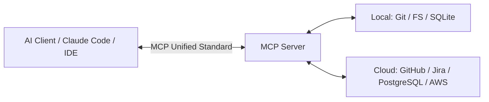

# Understanding Model Context Protocol (MCP)

**Model Context Protocol (MCP)**, open-sourced by Anthropic, is an open standard designed to seamlessly connect AI models with external tools, APIs, and isolated data repositories.

## 1. The Core Problem MCP Solves

Prior to MCP, tool integrations were fragmented across vendor-specific implementations (e.g., OpenAI Function Calling schemas, LangChain wrappers, custom IDE plugins).

**MCP serves as the universal USB-C standard for AI**: Build an MCP Server once, and connect it instantly to any MCP-compliant agent runtime without bespoke glue code.

## 2. The Three Core Capabilities of MCP

1. **Prompts**: Standardized, parameter-driven prompt workflows exposed by the server.
2. **Resources**: Safe, read-only data streams (file trees, logs, schemas) attached dynamically to the context.
3. **Tools**: Callable execution interfaces (e.g., executing shell scripts, querying databases, dispatching webhooks).
