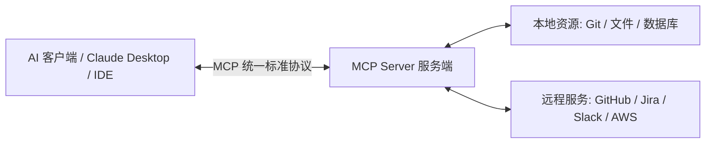

# 什么是 MCP（五）：Model Context Protocol 上下文协议

**MCP（Model Context Protocol，模型上下文协议）** 是由 Anthropic 开源的一套开放通信标准，旨在解决 AI 模型连接异构数据源与工具时的“协议孤岛”问题。

## 1. 为什么我们需要 MCP？

在 MCP 诞生之前，每个 AI 框架或工具都在重复造轮子：
- 为 ChatGPT 写一套 Actions/Plugin；
- 为 LangChain 写一套 Tool；
- 为 IDE 插件又写一套定制 API。

**MCP 的价值就像是 AI 时代的 USB-C 接口**：只需要开发一次 MCP Server，任何支持 MCP 协议的 Agent 客户端（如 Claude Code、Cursor、Claude Desktop）都可以即插即用。

## 2. MCP 的三大核心能力

1. **Prompts（预设提示词模板）**：服务器向客户端暴露经过精心设计的对话模板。
2. **Resources（上下文资源）**：安全地向模型提供文件、数据库日志、项目文档等只读上下文。
3. **Tools（可执行工具）**：向模型暴露具体的函数调用能力（如执行 Git Commit、发布 PR、查询 PostgreSQL）。

---

> 🔗 **微信公众号原文**：[什么是 MCP(五)](http://mp.weixin.qq.com/s?__biz=Mzk0NzYxMDM0Mw==&mid=2247484221&idx=1&sn=083f56a10a65d605c804153a50758c6f)
