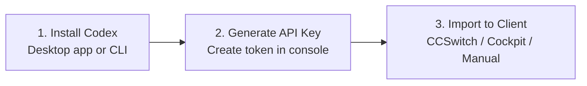

# 🚀 Getting Started with Codex & Unified API Gateway

:::info Overview
This complete guide walks you through **installing Codex (Desktop / CLI)**, importing configurations via **CCSwitch** or **Cockpit Tools**, manual configuration using **`config.toml`**, and direct code integration using the official **Python & Node.js SDKs**.

- **Unified API Base URL**: `https://vibecoding.kuyiduo.hidns.vip/v1` (Must end with lowercase `/v1`)
- **Protocol Support**: 100% compatible with OpenAI standard `Responses API` and `Chat Completions`
- **Recommended Models**: `gpt-5.6-luna` / `gpt-6-astra` / `gpt-image-2`
:::

---

## ⚡ 3-Step Quick Start



1. **Install Client**: Download and install Codex desktop or CLI, verify local execution;
2. **Obtain API Key**: Sign in to the [Sub2API Console](https://vibecoding.kuyiduo.hidns.vip), navigate to [API Tokens](https://vibecoding.kuyiduo.hidns.vip/tokens) to generate a new key (or get credits via [Instant Store](https://wzyp.cn/shop/ZW3KTBHW));
3. **Import Configuration**: Use CCSwitch one-click import, Cockpit, or manual `config.toml` settings.

---

## 1. Download & Install Codex

### Official Download Sources
- **Official ChatGPT Desktop (includes Codex runtime)**: [Download ChatGPT Desktop](https://chatgpt.com/zh-Hans-CN/download/)
- **Open Source Ecosystem**: [Codex GitHub Repository](https://github.com/openai/codex)

### Command-Line CLI Setup
For terminal users or headless environments (Linux / WSL / Containers):

```bash
# Global install via npm
npm install -g @openai/codex

# Launch and verify
codex
```

- **Windows**: Desktop client recommended. For CLI, install Node.js first and run inside PowerShell.
- **macOS**: Open Terminal; install Node.js via Homebrew if npm is missing.
- **Linux / WSL**: Ensure Node 18+ is installed, then run npm.

---

## 2. Option 1: CCSwitch One-Click Import (Recommended)

**CCSwitch** is a visual configuration manager designed specifically for Codex. It allows multi-provider management, key switching, and model tuning in a clean UI.

- **Official Website**: [CCSwitch Website](https://ccswitch.ai/)
- **Releases**: [GitHub Releases Download](https://github.com/farion1231/ccswitch/releases)

### Platform Selection Matrix

| Operating System | Recommended Package | Notes |
| :--- | :--- | :--- |
| **Windows** | `.msi` Installer | Automatic shortcuts and clean updates |
| **Windows Portable** | `.zip` Archive | For office machines without admin rights |
| **macOS** | `.dmg` Image | Drag to Applications folder |
| **Linux** | `.deb` / `.rpm` / `.AppImage` | Debian: deb, RedHat: rpm, Universal: AppImage |

### Import Steps
1. Launch CCSwitch;
2. Copy your API Key from [Sub2API Tokens Dashboard](https://vibecoding.kuyiduo.hidns.vip/tokens);
3. In CCSwitch, add a new Provider:
   - **Provider Name**: Custom (e.g. `Sub2API`)
   - **Base URL**: `https://vibecoding.kuyiduo.hidns.vip/v1` (**Must end with lowercase `/v1`**)
   - **API Key**: Paste your `sk-...` token
   - **Default Model**: `gpt-5.6-luna` or `gpt-6-astra`
4. Save and **fully restart Codex** to reload network contexts.

:::warning Critical Troubleshooting
The Base URL must end with lowercase `/v1`. Omitting `/v1` or using uppercase `/V1` will result in 404 routing errors!
:::

---

## 3. Option 2: Cockpit Tools Setup

**Cockpit Tools** is built for power users who want a unified desktop station to inspect quotas, manage multiple models, and supervise agent threads.

- **Project Repository**: [Cockpit Tools GitHub](https://github.com/jlcodes99/cockpit-tools)
- **Releases**: [Download Latest Cockpit](https://github.com/jlcodes99/cockpit-tools/releases)

### Step-by-Step Workflow
1. **Add Account**: Open Cockpit Tools, navigate to Codex Accounts, click the top-right **`+`** button;
2. **Select Custom Provider**: Choose **API Key**, set provider to **Custom** (Do not select official OAuth);
3. **Fill Credentials**:
   - **API Key**: Enter your `sk-...` token from the [Dashboard](https://vibecoding.kuyiduo.hidns.vip/tokens)
   - **Base URL**: `https://vibecoding.kuyiduo.hidns.vip/v1`
   - **Model**: `gpt-5.6-luna`
4. **Start & Connect**: Save and click the **Start Arrow** on the account card. Once status indicates "running", connection is established.

---

## 4. Option 3: Manual `config.toml` Configuration

For developers who prefer direct configuration file management:

File locations:
- Windows: `%USERPROFILE%\.codex\config.toml`
- macOS / Linux: `~/.codex/config.toml`

```toml
model = "gpt-5.6-luna"
model_provider = "custom_gateway"
model_reasoning_effort = "medium"
disable_response_storage = true

[model_providers.custom_gateway]
name = "custom_gateway"
base_url = "https://vibecoding.kuyiduo.hidns.vip/v1"
wire_api = "responses"
requires_openai_auth = true
experimental_bearer_token = "YOUR_API_KEY"
```

---

## 5. API Reference & Code Examples

All endpoints require standard `Bearer Token` authentication:

```http
Authorization: Bearer YOUR_API_KEY
Content-Type: application/json
```

### 1. Model Discovery (GET /v1/models)
Query all active models schedulable by your account:

```bash
curl https://vibecoding.kuyiduo.hidns.vip/v1/models \
  -H "Authorization: Bearer YOUR_API_KEY"
```

---

### 2. Responses API (Codex Native Protocol)
Recommended for modern OpenAI SDKs, tool calling, and structured outputs:

```bash
curl https://vibecoding.kuyiduo.hidns.vip/v1/responses \
  -H "Authorization: Bearer YOUR_API_KEY" \
  -H "Content-Type: application/json" \
  -d '{
    "model": "gpt-5.6-luna",
    "input": "Summarize the architectural advantages of LLM gateways in three sentences."
  }'
```

---

### 3. Chat Completions
Compatible with legacy OpenAI clients, bots, Cherry Studio, and NextChat:

```bash
curl https://vibecoding.kuyiduo.hidns.vip/v1/chat/completions \
  -H "Authorization: Bearer YOUR_API_KEY" \
  -H "Content-Type: application/json" \
  -d '{
    "model": "gpt-5.6-luna",
    "messages": [
      {"role": "user", "content": "Hello world"}
    ]
  }'
```

---

### 4. Streaming SSE
Set `stream: true` for low-latency incremental generation:

```bash
curl https://vibecoding.kuyiduo.hidns.vip/v1/chat/completions \
  -H "Authorization: Bearer YOUR_API_KEY" \
  -H "Content-Type: application/json" \
  -d '{
    "model": "gpt-5.6-luna",
    "stream": true,
    "messages": [
      {"role": "user", "content": "Write a quicksort implementation in Go."}
    ]
  }'
```

---

### 5. Multi-Language SDK Snippets

#### Python (Official OpenAI SDK)
```python
import os
from openai import OpenAI

client = OpenAI(
    api_key=os.getenv("API_KEY", "YOUR_API_KEY"),
    base_url="https://vibecoding.kuyiduo.hidns.vip/v1",
)

response = client.chat.completions.create(
    model="gpt-5.6-luna",
    messages=[
        {"role": "user", "content": "Hello from Python!"}
    ],
)
print(response.choices[0].message.content)
```

#### Node.js / TypeScript
```typescript
import OpenAI from "openai";

const client = new OpenAI({
  apiKey: process.env.API_KEY || "YOUR_API_KEY",
  baseURL: "https://vibecoding.kuyiduo.hidns.vip/v1",
});

async function main() {
  const completion = await client.chat.completions.create({
    model: "gpt-5.6-luna",
    messages: [{ role: "user", content: "Hello from Node.js!" }],
  });
  console.log(completion.choices[0].message.content);
}

main();
```

---

## 6. Error Codes & Troubleshooting

| Status / Symptom | Root Cause | Action |
| :--- | :--- | :--- |
| **`401 Unauthorized`** | Invalid key or syntax error | Re-copy key and trim whitespace |
| **`403 Forbidden`** | Insufficient balance or group permission | Top up balance or inspect model group permissions |
| **`404 Not Found`** | Malformed Base URL | Ensure URL is `https://vibecoding.kuyiduo.hidns.vip/v1` with lowercase `/v1` |
| **`Model Not Found`** | Model ID not in schedulable list | Query `GET /v1/models` to check real-time availability |
| **Latency High** | High reasoning effort on deep models | Switch to faster models (e.g. `gpt-5.4-mini`) or lower reasoning effort |

---

## 📋 Production Readiness Checklist

- [ ] Base URL includes `/v1` suffix;
- [ ] API Key stored securely in environment variables;
- [ ] Successful `GET /v1/models` probe;
- [ ] Verified both non-streaming and streaming responses;
- [ ] Restarted Codex/Cockpit/CCSwitch after configuration changes.
