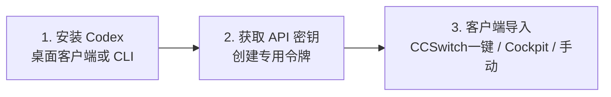

# 🚀 从安装 Codex 开始接入 API 网关

:::info 快速摘要
本指南完整梳理从 **下载安装 Codex（桌面版 / CLI）**、通过 **CCSwitch 或 Cockpit 可视化工具一键导入**，到 **手动配置 `config.toml`** 以及 **Python / Node.js SDK 直连** 的全流程实操步骤。

- **统一 API Base URL**：`https://vibecoding.kuyiduo.hidns.vip/v1`（末尾必须带小写 `/v1`）
- **协议兼容性**：100% 兼容 OpenAI 标准的 `Responses API` 与 `Chat Completions` 接口
- **默认推荐模型**：`gpt-5.6-luna` / `gpt-6-astra` / `gpt-image-2`
:::

---

## ⚡ 极速起步 3 步法



1. **安装客户端**：下载安装 Codex 桌面版，确保本机正常运行；
2. **准备 API Key**：登录 [API 控制台](https://vibecoding.kuyiduo.hidns.vip)，进入 [API 密钥管理页面](https://vibecoding.kuyiduo.hidns.vip/tokens) 创建并复制专属 Key（如果没有 Key，也可通过 [在线充值发卡站](https://wzyp.cn/shop/ZW3KTBHW) 快速获取）；
3. **导入配置**：使用 CCSwitch 一键导入，或在 Cockpit / `config.toml` 填入 Base URL 与 Key。

---

## 一、下载并安装 Codex

### 1. 官方下载渠道
- **官方安装包下载**：[ChatGPT 桌面版下载 (含 Codex 运行环境)](https://chatgpt.com/zh-Hans-CN/download/)
- **开源生态仓库**：[Codex GitHub 仓库](https://github.com/openai/codex)

### 2. 命令行 CLI 快速安装
如果你习惯在终端或无图形界面的开发机（如 Linux / WSL / 容器）使用，可直接通过 npm 安装：

```bash
# 全局安装 Codex CLI
npm install -g @openai/codex

# 启动并测试
codex
```

- **Windows 系统**：优先推荐使用桌面版客户端；若使用 CLI，请先安装 Node.js，并在管理员 PowerShell 中执行。
- **macOS 系统**：打开终端执行命令，如提示找不到 `npm`，请先通过 Homebrew 安装 Node.js。
- **Linux / WSL**：在 Ubuntu/Debian 环境下确保 Node 18+，安装后即可直接在终端呼出。

---

## 二、配置方式一：CCSwitch 一键导入（新手推荐）

**CCSwitch** 是专为 Codex 打造的现代化可视化配置切换工具，能够轻松管理模型、API Key 和 Base URL，并支持一键多环境切换。

- **官网主页**：[CCSwitch 官方网站](https://ccswitch.ai/)
- **安装包发布页**：[GitHub Releases 下载](https://github.com/farion1231/ccswitch/releases)

### 系统版本推荐对照表

| 操作系统 | 推荐下载格式 | 适用场景 |
| :--- | :--- | :--- |
| **Windows 电脑** | `.msi` 安装包 | 推荐绝大多数用户，支持自动创建快捷方式与平滑更新 |
| **Windows 便携版** | `.zip` 免安装包 | 适合公司办公电脑受限、无法获取安装权限场景 |
| **macOS** | `.dmg` 镜像 | 挂载后直接拖拽到 Applications，即开即用 |
| **Linux 发行版** | `.deb` / `.rpm` / `.AppImage` | Ubuntu/Debian 选 deb，Fedora 选 rpm，通用选 AppImage |

### 导入操作步骤
1. 确认本机已安装并能正常打开 CCSwitch；
2. 登录 [Sub2API 控制台](https://vibecoding.kuyiduo.hidns.vip)，进入 [API 密钥](https://vibecoding.kuyiduo.hidns.vip/tokens) 页面，复制生成的专属 API Key；
3. 在 CCSwitch 中点击添加服务商：
   - **服务商名称**：自定义（如 `Sub2API`）
   - **API Base URL**：`https://vibecoding.kuyiduo.hidns.vip/v1`（**注意：必须以小写 `/v1` 结尾**）
   - **API Key**：填入复制的 `sk-...`
   - **默认模型**：填入 `gpt-5.6-luna` 或 `gpt-6-astra`
4. 点击保存；如果 Codex 正在运行，**请完全退出并重启 Codex** 即可使新网关生效。

:::warning 常见避坑提示
Base URL 必须严格以 `/v1` 结尾。漏填 `/v1`、误写成大写 `/V1` 或只填主域名，都会导致客户端发出路径拼接错误而报 404！
:::

---

## 三、配置方式二：Cockpit Tools 图文指南

**Cockpit Tools** 适合需要在单个桌面控制台集中监控与调配会话、渠道、API 额度的高级用户。

- **项目主页**：[Cockpit Tools 项目仓库](https://github.com/jlcodes99/cockpit-tools)
- **最新发布包**：[GitHub Releases 下载](https://github.com/jlcodes99/cockpit-tools/releases)

### 4 步接入流程
1. **添加账号**：启动 Cockpit Tools，进入 Codex 账号页，点击右上角 **`+`** 号；
2. **选择自定义 API**：在类型窗口选择 **API Key**，服务提供商选择 **自定义 (Custom)**，切勿选择官方 OAuth 登录；
3. **填入网关凭据**：
   - **API Key**：填入在 [控制台密钥页](https://vibecoding.kuyiduo.hidns.vip/tokens) 生成的 `sk-...` 令牌
   - **基础地址 (Base URL)**：`https://vibecoding.kuyiduo.hidns.vip/v1`
   - **模型名**：填入 `gpt-5.6-luna`
4. **启动并连接**：保存配置后回到账号卡片，点击底部的 **启动箭头**，卡片状态切换为“运行中”即表示接管成功。

---

## 四、配置方式三：纯手动配置 `config.toml`

适合熟悉 CLI 与配置文件的极客开发者。直接在当前用户根目录的 Codex 配置文件中定义 `model_providers`。

编辑文件路径：
- Windows：`%USERPROFILE%\.codex\config.toml`
- macOS / Linux：`~/.codex/config.toml`

```toml
model = "gpt-5.6-luna"
model_provider = "custom_gateway"
model_reasoning_effort = "medium"
disable_response_storage = true

[model_providers.custom_gateway]
name = "custom_gateway"
base_url = "https://vibecoding.kuyiduo.hidns.vip/v1"
wire_api = "responses"
requires_openai_auth = true
experimental_bearer_token = "YOUR_API_KEY"
```

> ⚠️ **安全警告**：API Key 属于核心敏感凭证，严禁提交到公共 GitHub 仓库、公开截图或发到公共聊天群组中。

---

## 五、接口调用与开发实战

所有接口均采用业界标准的 `Bearer Token` 鉴权：

```http
Authorization: Bearer YOUR_API_KEY
Content-Type: application/json
```

### 1. 验证可用模型列表 (GET /v1/models)
在发起复杂请求前，推荐先调用一次模型端点，验证 Key 是否正常以及当前账号可调度的模型列表：

```bash
curl https://vibecoding.kuyiduo.hidns.vip/v1/models \
  -H "Authorization: Bearer YOUR_API_KEY"
```

常用支持模型：
- **编程与深度推理**：`gpt-5.6-luna`, `gpt-5.6-sol`, `gpt-6-astra`, `claude-3-5-sonnet-20241022`
- **极速响应**：`gpt-5.4-mini`, `gemini-3.8-flash`
- **多模态视觉与生图**：`gpt-image-2`, `gpt-image-1.5`, `dall-e-3`

---

### 2. Responses API (Codex 原生协议)
适合新版 OpenAI SDK、Agent 自动化工作流与工具调用：

```bash
curl https://vibecoding.kuyiduo.hidns.vip/v1/responses \
  -H "Authorization: Bearer YOUR_API_KEY" \
  -H "Content-Type: application/json" \
  -d '{
    "model": "gpt-5.6-luna",
    "input": "请用三句话总结大语言模型网关的核心价值"
  }'
```

---

### 3. Chat Completions 对话接口
兼容绝大多数开源客户端（如 NextChat、Cherry Studio、ChatBox、Open WebUI）：

```bash
curl https://vibecoding.kuyiduo.hidns.vip/v1/chat/completions \
  -H "Authorization: Bearer YOUR_API_KEY" \
  -H "Content-Type: application/json" \
  -d '{
    "model": "gpt-5.6-luna",
    "messages": [
      {"role": "user", "content": "你好，请自我介绍"}
    ]
  }'
```

---

### 4. 流式传输 (Streaming SSE)
需要流式逐字打字机效果时，将 `stream` 设置为 `true`：

```bash
curl https://vibecoding.kuyiduo.hidns.vip/v1/chat/completions \
  -H "Authorization: Bearer YOUR_API_KEY" \
  -H "Content-Type: application/json" \
  -d '{
    "model": "gpt-5.6-luna",
    "stream": true,
    "messages": [
      {"role": "user", "content": "写一段快速排序的 Go 语言实现"}
    ]
  }'
```

---

### 5. 多语言 SDK 代码接入

#### Python (OpenAI 官方 SDK)
```python
import os
from openai import OpenAI

client = OpenAI(
    api_key=os.getenv("API_KEY", "YOUR_API_KEY"),
    base_url="https://vibecoding.kuyiduo.hidns.vip/v1",
)

response = client.chat.completions.create(
    model="gpt-5.6-luna",
    messages=[
        {"role": "user", "content": "Hello, API Gateway!"}
    ],
)
print(response.choices[0].message.content)
```

#### Node.js / TypeScript
```typescript
import OpenAI from "openai";

const client = new OpenAI({
  apiKey: process.env.API_KEY || "YOUR_API_KEY",
  baseURL: "https://vibecoding.kuyiduo.hidns.vip/v1",
});

async function main() {
  const completion = await client.chat.completions.create({
    model: "gpt-5.6-luna",
    messages: [{ role: "user", content: "Hello from Node.js!" }],
  });
  console.log(completion.choices[0].message.content);
}

main();
```

---

## 六、常见错误与运维排错清单

| 状态码 / 错误表现 | 根本原因定位 | 解决措施 |
| :--- | :--- | :--- |
| **`401 Unauthorized`** | API Key 错误、已被禁用或格式有误 | 重新检查复制的 Key，确认无首尾多余空格与换行 |
| **`403 Forbidden`** | 账户余额不足或无当前分组权限 | 确认账户余额大于 0，并核对令牌关联的模型分组 |
| **`404 Not Found`** | Base URL 填写错误 | 确认地址为 `https://vibecoding.kuyiduo.hidns.vip/v1`，且末尾 `/v1` 为小写 |
| **`Model Not Found`** | 模型名未在当前可调度列表中 | 先调用 `GET /v1/models` 查看当前账号实际支持的模型清单 |
| **响应耗时过长** | 模型处于超深度思考推理状态 | 可切换为轻量模型（如 `gpt-5.4-mini`），或调小 `reasoning_effort` 参数 |

---

## 📋 生产上线自检 Checklist

- [ ] **Base URL** 已正确填入且带有 `/v1` 后缀；
- [ ] **API Key** 安全留存在本机配置文件或环境变量中，未上传代码仓库；
- [ ] 使用 `curl` 顺利完成一次 `GET /v1/models` 探测；
- [ ] 分别跑通了一次非流式调用与一次流式（Stream）输出测试；
- [ ] 若在客户端（Codex / Cockpit / CCSwitch）中修改了配置，已彻底重启客户端使其重新加载网络上下文。
