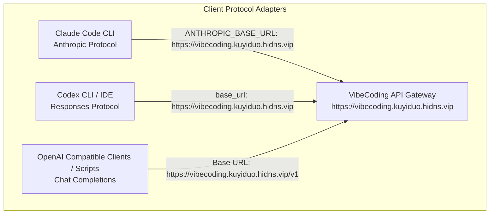
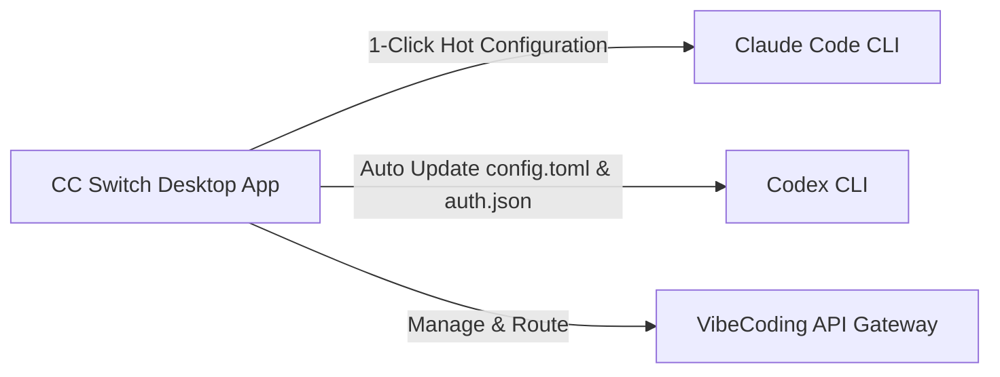

# 🛠️ AI Developer Tools Integration Guide (Claude Code / Codex / OpenAI Clients)


:::info Overview
This guide covers connecting leading AI coding agents and development tools (Claude Code, Codex, Cursor, Pi, Cherry Studio, OpenCode, etc.) to the API gateway service (`https://vibecoding.kuyiduo.hidns.vip`), including protocol specifications, configuration templates, routing patterns, and troubleshooting steps.
:::



---

## 📌 1. API Base URL & Routing Rules (Prevent 404s)

Different client protocols define `Base URL` differently. **Do not blindly append `/v1` across all configurations**:

| Client Protocol / Scenario | Base URL Format | Actual Request Endpoint | Notes |
| :--- | :--- | :--- | :--- |
| **Claude Code (Anthropic)** | `https://vibecoding.kuyiduo.hidns.vip` | `/v1/messages` (Auto-appended by SDK) | **Do not** append `/v1` to the Base URL |
| **Codex CLI / IDE** | `https://vibecoding.kuyiduo.hidns.vip` | `/responses` (Wire API) | Managed via `config.toml` |
| **OpenAI Compatible Clients** | `https://vibecoding.kuyiduo.hidns.vip/v1` | `/v1/chat/completions` | Standard OpenAI SDKs require `/v1` |
| **Model List Query** | `https://vibecoding.kuyiduo.hidns.vip/v1/models` | `/v1/models` | Direct GET query for supported models |

---

## ⚡ 2. Claude Code Configuration

Claude Code connects natively via the Anthropic API protocol.

### Step 1: Install Claude Code CLI

Ensure you have Node.js LTS (>= 18.0.0) installed:

```bash
# Verify environment
node --version
npm --version

# Install Claude Code globally
npm install -g @anthropic-ai/claude-code

# Verify installation
claude --version
```

### Option A: Temporary Environment Variables (Quick Test)

Ideal for quick sanity checks in your current terminal:

**Windows PowerShell:**
```powershell
$env:ANTHROPIC_BASE_URL = "https://vibecoding.kuyiduo.hidns.vip"
$env:ANTHROPIC_AUTH_TOKEN = "YOUR_API_KEY"
$env:CLAUDE_CODE_DISABLE_NONESSENTIAL_TRAFFIC = "1"
claude -p "Reply with exactly: api-ok"
```

**macOS / Linux (Bash / Zsh):**
```bash
export ANTHROPIC_BASE_URL="https://vibecoding.kuyiduo.hidns.vip"
export ANTHROPIC_AUTH_TOKEN="YOUR_API_KEY"
export CLAUDE_CODE_DISABLE_NONESSENTIAL_TRAFFIC="1"
claude -p "Reply with exactly: api-ok"
```

### Option B: Persistent `settings.json` Configuration (Recommended)

Persists across terminal sessions:

- **Windows**: `%USERPROFILE%\.claude\settings.json`
- **macOS / Linux**: `~/.claude/settings.json`

```json
{
  "env": {
    "ANTHROPIC_BASE_URL": "https://vibecoding.kuyiduo.hidns.vip",
    "ANTHROPIC_AUTH_TOKEN": "YOUR_API_KEY",
    "CLAUDE_CODE_DISABLE_NONESSENTIAL_TRAFFIC": "1"
  }
}
```

:::warning Note
Set `ANTHROPIC_BASE_URL` to the bare root domain `https://vibecoding.kuyiduo.hidns.vip`. Do not append `/v1` or `/messages`.
:::

---

## 🤖 3. OpenAI Codex Configuration

Codex CLI and IDE extensions load settings from the `.codex` folder in your user home directory.

### Configuration File Paths

- **Windows**: `%USERPROFILE%\.codex\`
- **macOS / Linux**: `~/.codex/`

### `config.toml`

Create or edit `config.toml` in your `.codex` directory:

```toml
model_provider = "VibeCoding"
model = "gpt-5.6-sol"
review_model = "gpt-5.6-sol"
model_reasoning_effort = "high"
disable_response_storage = true
network_access = "enabled"

[model_providers.VibeCoding]
name = "VibeCoding API"
base_url = "https://vibecoding.kuyiduo.hidns.vip"
wire_api = "responses"
requires_openai_auth = true
```

### `auth.json`

Create or edit `auth.json` in the same folder:

```json
{
  "OPENAI_API_KEY": "YOUR_API_KEY"
}
```

### Verification

Restart your terminal or Codex application and execute:

```bash
codex "Reply with exactly: api-ok"
```

---

## 🎛️ 4. CC Switch Desktop Assistant (One-Click Provider Switcher)

[CC Switch (ccswitch.io)](https://ccswitch.io) is a cross-platform desktop All-in-One assistant tailored for Claude Code, Codex, and OpenCode, enabling instant provider and environment switching.



### Setup Steps

1. **Install CC Switch**: Download the binary for Windows / macOS / Linux from [CC Switch Official Website](https://ccswitch.io) or [GitHub Releases](https://github.com/farion1231/cc-switch/releases).
2. **Add Custom Provider**:
   - **Provider Name**: `VibeCoding`
   - **Target Agent**: Choose `Claude Code` or `Codex`
   - **Base URL**:
     - Claude Code mode: `https://vibecoding.kuyiduo.hidns.vip`
     - OpenAI / Codex mode: `https://vibecoding.kuyiduo.hidns.vip`
   - **API Key**: Enter your generated API Token
   - **Model ID**: Active model ID (e.g., `claude-3-7-sonnet-20250219` or `gpt-5.6-sol`)
3. **Activate**: Click **Activate / Switch**. CC Switch automatically synchronizes environment variables and local config files without requiring manual edits to `settings.json` or `config.toml`.

---

## 🌐 5. Generic OpenAI-Compatible Clients (Chat Completions)

Applicable to tools like Pi, Cursor, Cherry Studio, OpenCode, NextChat, etc.

### Parameter Mapping

| Setting (Key) | Value |
| :--- | :--- |
| **Base URL / API Host** | `https://vibecoding.kuyiduo.hidns.vip/v1` |
| **API Key / Token** | Your generated API Key |
| **API Type** | OpenAI / Chat Completions |
| **Model ID** | Current active model ID in your console (e.g., `gpt-5.6-sol`, `claude-3-7-sonnet-20250219`) |

### cURL Verification Command

```bash
curl --http1.1 https://vibecoding.kuyiduo.hidns.vip/v1/chat/completions \
  -H "Authorization: Bearer YOUR_API_KEY" \
  -H "Content-Type: application/json" \
  -d '{
    "model": "gpt-5.6-sol",
    "messages": [
      {"role": "user", "content": "Reply with exactly: api-ok"}
    ],
    "max_completion_tokens": 32
  }'
```

---

## 📦 6. Official Client & Dependency Downloads

Always obtain installers and dependencies directly from official channels:

| Tool / Dependency | Description | Official Link |
| :--- | :--- | :--- |
| **CC Switch** | All-in-One provider switcher for Claude Code & Codex | [CC Switch Official](https://ccswitch.io/) \| [GitHub](https://github.com/farion1231/cc-switch) |
| **Claude Code** | Anthropic's autonomous terminal coding agent | [Anthropic Docs](https://docs.anthropic.com/en/docs/claude-code) |
| **Codex** | OpenAI Codex desktop, CLI & IDE tools | [OpenAI Codex GitHub](https://github.com/openai/codex) |
| **Node.js LTS** | Runtime for Claude Code and Codex CLI | [Node.js Official](https://nodejs.org/) |
| **Python** | Python runtime for local API scripting | [Python Downloads](https://www.python.org/downloads/) |
| **OpenCode** | Open-source terminal coding assistant | [OpenCode Official](https://opencode.ai/) |
| **Cherry Studio** | Multi-model desktop AI client | [Cherry Studio](https://www.cherry-ai.com/) |

---

## 🚨 7. Troubleshooting

- **401 Unauthorized**: Ensure your token is passed via `Authorization: Bearer YOUR_KEY` without extra spaces or line breaks, and that the key group contains the required model.
- **404 Not Found**: Check for duplicate `/v1` in the path (e.g. `.../v1/v1/...`). Verify model ID against the console.
- **429 Rate Limit**: Reduce request concurrency and verify account quota.
- **502 / 503 Upstream Error**: Upstream provider hiccup. Retry after a short backoff or switch to a backup model.

---

## 📊 8. Service Status & Benchmark References

- **Status Monitors**: [OpenAI Status](https://status.openai.com/) | [Anthropic Status](https://status.anthropic.com/)
- **Public Benchmarks**: [Artificial Analysis](https://artificialanalysis.ai/models) | [LMArena Leaderboard](https://lmarena.ai/leaderboard) | [LiveBench](https://livebench.ai/)
