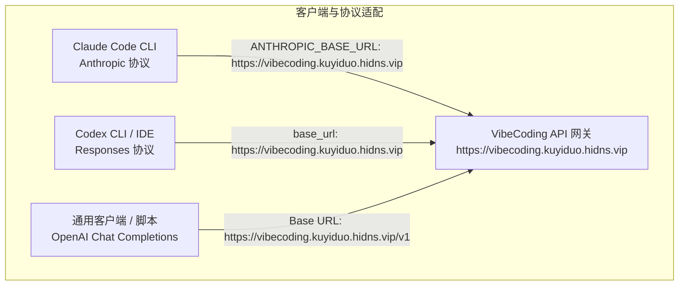
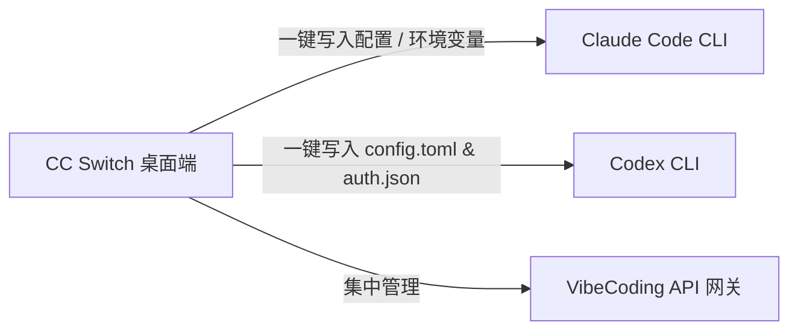

# 🛠️ AI 编码开发工具接入实战 (Claude Code / Codex / 通用客户端)

:::info 说明
本指南系统整理主流 AI 编程 Agent 与代码助手工具（Claude Code、Codex、Cursor、Pi、Cherry Studio 等）接入本站 API 网关服务（`https://vibecoding.kuyiduo.hidns.vip`）的协议规范、配置模版、路由格式及连通性排错方案。
:::



---

## 📌 一、API 地址与路由规范（关键：避免 404）

不同客户端协议对 Base URL 的解析规则各不相同，**切勿盲目重复拼接 `/v1`**：

| 客户端协议 / 场景 | Base URL 填写格式 | 实际请求端点 (Endpoint) | 说明 |
| :--- | :--- | :--- | :--- |
| **Claude Code (Anthropic)** | `https://vibecoding.kuyiduo.hidns.vip` | `/v1/messages` (SDK 内部自动拼接) | **切勿**在 Base URL 尾部手动加 `/v1` |
| **Codex CLI / IDE** | `https://vibecoding.kuyiduo.hidns.vip` | `/responses` (Wire API) | 通过 `config.toml` 配置 |
| **通用 OpenAI 兼容客户端** | `https://vibecoding.kuyiduo.hidns.vip/v1` | `/v1/chat/completions` | OpenAI SDK 约定需包含 `/v1` |
| **模型列表查询** | `https://vibecoding.kuyiduo.hidns.vip/v1/models` | `/v1/models` | GET 请求直接查询可用模型 |

---

## ⚡ 二、Claude Code 接入配置

Claude Code 原生基于 Anthropic 协议进行通信。

### 1. 环境依赖与安装

确保系统具备 Node.js LTS (>= 18.0.0) 环境：

```bash
# 检查依赖
node --version
npm --version

# 全局安装 Claude Code CLI
npm install -g @anthropic-ai/claude-code

# 验证安装
claude --version
```

### 2. 方案 A：PowerShell / Shell 临时环境变量（快速测试）

适用于快速调试或临时终端会话：

**Windows PowerShell:**
```powershell
$env:ANTHROPIC_BASE_URL = "https://vibecoding.kuyiduo.hidns.vip"
$env:ANTHROPIC_AUTH_TOKEN = "YOUR_API_KEY"
$env:CLAUDE_CODE_DISABLE_NONESSENTIAL_TRAFFIC = "1"
claude -p "请只回复：api-ok"
```

**macOS / Linux (Bash / Zsh):**
```bash
export ANTHROPIC_BASE_URL="https://vibecoding.kuyiduo.hidns.vip"
export ANTHROPIC_AUTH_TOKEN="YOUR_API_KEY"
export CLAUDE_CODE_DISABLE_NONESSENTIAL_TRAFFIC="1"
claude -p "请只回复：api-ok"
```

### 3. 方案 B：`settings.json` 持久化配置（推荐）

保存后全局生效，重启终端无需重复声明：

- **Windows 路径**：`%USERPROFILE%\.claude\settings.json`
- **macOS / Linux 路径**：`~/.claude/settings.json`

```json
{
  "env": {
    "ANTHROPIC_BASE_URL": "https://vibecoding.kuyiduo.hidns.vip",
    "ANTHROPIC_AUTH_TOKEN": "YOUR_API_KEY",
    "CLAUDE_CODE_DISABLE_NONESSENTIAL_TRAFFIC": "1"
  }
}
```

:::warning 格式提醒
`ANTHROPIC_BASE_URL` 填写裸地址 `https://vibecoding.kuyiduo.hidns.vip`，不要追加 `/v1` 或 `/messages`。
:::

---

## 🤖 三、Codex 接入配置

Codex 的桌面应用、IDE 插件和 CLI 读取用户目录下的 `.codex` 配置文件。

### 1. 配置文件路径

- **Windows 路径**：`%USERPROFILE%\.codex\`
- **macOS / Linux 路径**：`~/.codex/`

### 2. 创建或编辑 `config.toml`

在配置目录下新建或编辑 `config.toml`：

```toml
model_provider = "VibeCoding"
model = "gpt-5.6-sol"
review_model = "gpt-5.6-sol"
model_reasoning_effort = "high"
disable_response_storage = true
network_access = "enabled"

[model_providers.VibeCoding]
name = "VibeCoding API"
base_url = "https://vibecoding.kuyiduo.hidns.vip"
wire_api = "responses"
requires_openai_auth = true
```

### 3. 配置认证文件 `auth.json`

在同一目录下创建或编辑 `auth.json`：

```json
{
  "OPENAI_API_KEY": "YOUR_API_KEY"
}
```

### 4. 重启与验证

彻底退出旧终端或 IDE 窗口后重新启动：

```bash
codex "请只回复：api-ok"
```

---

## 🎛️ 四、CC Switch 桌面助手一键切换配置

[CC Switch (ccswitch.io)](https://ccswitch.io) 是一款专为 Claude Code、Codex、OpenCode 等 Agent CLI 打造的跨平台多服务商管理与一键切换桌面端工具。



### 1. 快速接入步骤

1. **下载安装**：前往 [CC Switch 官网](https://ccswitch.io) 或 [GitHub Releases](https://github.com/farion1231/cc-switch/releases) 下载对应系统安装包（Windows / macOS / Linux）。
2. **添加 Provider 服务商**：
   - **服务商名称 (Provider Name)**：`VibeCoding`
   - **适用目标 (Target Agent)**：选择 `Claude Code` 或 `Codex`
   - **Base URL**：
     - Claude Code 模式填入：`https://vibecoding.kuyiduo.hidns.vip`
     - OpenAI / Codex 模式填入：`https://vibecoding.kuyiduo.hidns.vip`
   - **API Key**：填入控制台获取的 API 密钥
   - **模型 (Model)**：填入当前可用模型 ID（如 `claude-3-7-sonnet-20250219` 或 `gpt-5.6-sol`）
3. **一键激活 (Apply / Switch)**：
   - 点击 **Activate / Switch** 按钮，CC Switch 会自动接管并热更新当前系统的环境变量与配置文件，无需手动修改 `settings.json` 或 `config.toml`。

---

## 🌐 五、通用 OpenAI 兼容客户端配置

适用于 Pi、Cursor、Cherry Studio、OpenCode、NextChat 等兼容 OpenAI 协议的工具。

### 1. 参数对照表

| 配置项 (Key) | 填写内容 (Value) |
| :--- | :--- |
| **Base URL / API 域名** | `https://vibecoding.kuyiduo.hidns.vip/v1` |
| **API Key / Token** | 控制台生成的专属 API 密钥 |
| **API 协议类型** | OpenAI / Chat Completions |
| **模型 ID** | 控制台当前可用的模型 ID（如 `gpt-5.6-sol`、`claude-3-7-sonnet-20250219` 等） |

### 2. cURL 命令行最小连通性验证

```bash
curl --http1.1 https://vibecoding.kuyiduo.hidns.vip/v1/chat/completions \
  -H "Authorization: Bearer YOUR_API_KEY" \
  -H "Content-Type: application/json" \
  -d '{
    "model": "gpt-5.6-sol",
    "messages": [
      {"role": "user", "content": "Reply with exactly: api-ok"}
    ],
    "max_completion_tokens": 32
  }'
```

---

## 📦 六、官方客户端与环境依赖下载

建议仅从官方渠道或 GitHub Releases 获取安装包：

| 工具 / 运行时 | 功能说明 | 官方渠道 |
| :--- | :--- | :--- |
| **CC Switch** | Claude Code / Codex 多服务商一键切换桌面助手 | [CC Switch 官网](https://ccswitch.io/) ｜ [GitHub](https://github.com/farion1231/cc-switch) |
| **Claude Code** | Anthropic 官方终端自主编程 Agent | [Anthropic 官方文档](https://docs.anthropic.com/en/docs/claude-code) |
| **Codex** | 桌面、IDE 与 CLI 编程工具 | [OpenAI Codex GitHub](https://github.com/openai/codex) |
| **Node.js LTS** | Claude Code CLI 运行时依赖 | [Node.js 官方下载](https://nodejs.org/) |
| **Python** | 本地脚本编写与 API 自动化 | [Python 官方下载](https://www.python.org/downloads/) |
| **OpenCode** | 开源终端编程助手 | [OpenCode 官网](https://opencode.ai/) |
| **Cherry Studio** | 跨平台多模型桌面客户端 | [Cherry Studio 官网](https://www.cherry-ai.com/) |

---

## 🚨 七、常见问题与排错指南 (Troubleshooting)

### 1. 401 Unauthorized / Invalid API Key
- **检查 Key 格式**：确认请求头为 `Authorization: Bearer YOUR_KEY`，前后未包含多余空格或换行。
- **Key 状态**：在控制台检查该 Key 是否已启用或包含对应的模型分组权限。

### 2. 404 Not Found
- **路径重复拼接**：检查是否写成了 `https://vibecoding.kuyiduo.hidns.vip/v1/v1/chat/completions`。
- **模型 ID 错误**：确认调用的模型 ID 与控制台列表严格一致。

### 3. 429 Rate Limit / 余额与并发受限
- 降低并发请求频率，检查控制台额度与并发配置。

### 4. 502 / 503 Upstream Error
- 属于上游渠道临时波动，稍后重试或切换备用模型分组。

---

## 📊 八、官方服务状态与模型评测对比

在定位问题与模型选型时，可参考以下官方状态页与公开评测基准：

- **官方服务状态**：[OpenAI Status](https://status.openai.com/) ｜ [Anthropic Status](https://status.anthropic.com/)
- **模型能力评测**：[Artificial Analysis](https://artificialanalysis.ai/models) ｜ [LMArena Leaderboard](https://lmarena.ai/leaderboard) ｜ [LiveBench](https://livebench.ai/)
