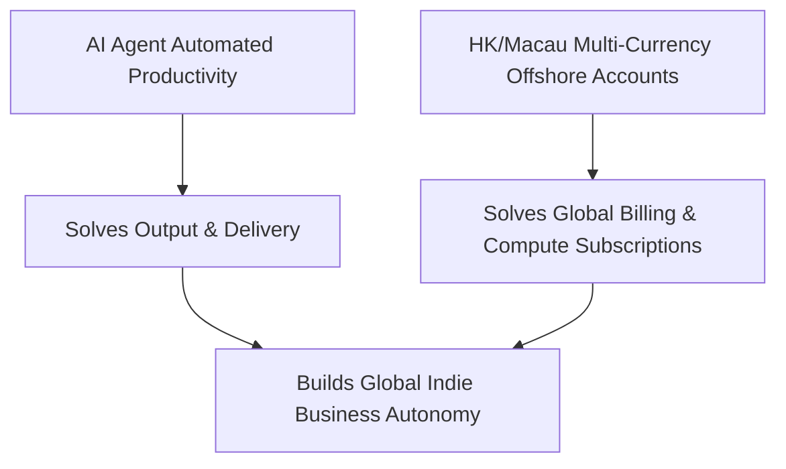

# Why AI Agent Developers Care About HK & Macau Financial Infrastructure

Many people ask me: As a software engineer deeply immersed in AI Agents, LLM infrastructure, and automation toolchains, why do I invest significant effort exploring **Hong Kong and Macau bank accounts, multi-currency payment channels, and cross-border capital routing**?

The reasoning is straightforward: **Code and AI Agents solve the "productivity equation", whereas offshore financial infrastructure solves the "monetization loop and asset autonomy equation".**

## 1. Unlocking Global AI Infrastructure

Developers leveraging cutting-edge LLMs inevitably encounter strict card decline policies:
- Official subscriptions and enterprise API billing for **OpenAI, Anthropic Claude, Cursor, and GitHub Copilot** enforce rigorous risk management.
- Mainland payment cards frequently trigger fraud flags or silent account suspensions.
- Holding genuine **VISA / Mastercard Debit Cards issued by Hong Kong or Macau banks** with real billing address matching enables seamless access to global AI infrastructure without third-party middleman risks.

## 2. Payouts for Indie Hackers & Global Micro-SaaS

Whether building AI Micro-SaaS, browser extensions, or remote consulting:
- Payouts from **Stripe, Lemon Squeezy, or PayPal** can be directly swept into HK banks (HSBC / BOCHK) in USD / HKD with near-zero conversion friction.
- Seamless instantaneous peer-to-peer settlement across the entire Hong Kong banking network via **FPS (Faster Payment System)**.

## 3. Financial Architecture via Engineering Mindset

As software engineers, we design fault-tolerant systems with redundancy and failover routing. Capital flow deserves the exact same **resilient architecture**:
- **Primary Tier-1 Core**: HSBC Hong Kong + Bank of China HK as foundational multi-currency reservoirs for large transfers and broker integration.
- **Agile Edge Layer**: ZA Bank HK + Ant Bank Macau for zero-fee micro-transactions, merchant testing, and rapid card creation.
