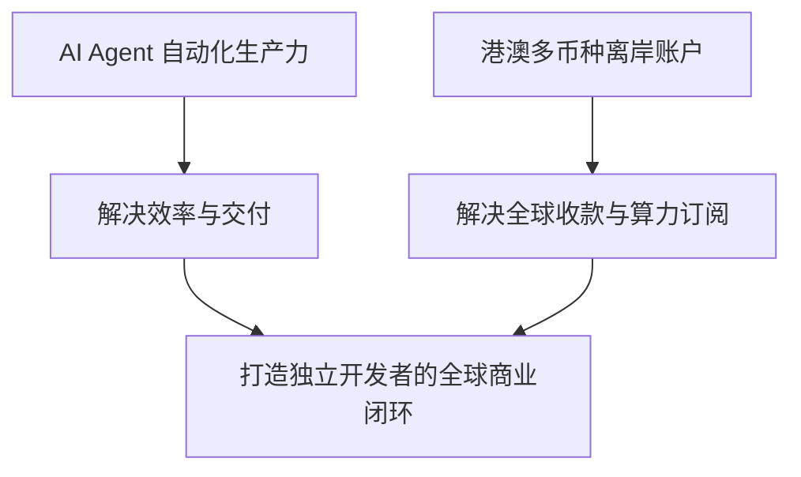

# 做 AI Agent 的人，为什么会开始在意港澳基础设施？

很多人问我：作为一个长期跟代码、大模型、AI Agent、自动化工具打交道的开发者，为什么会花大量精力去研究**香港和澳门的银行账户、支付渠道与跨境资产链路**？

其实逻辑非常简单：**代码和 Agent 解决的是“生产力问题”，而离岸金融基础设施解决的是“生产关系的闭环与资产安全问题”。**

## 1. 全球顶级 AI 基础设施的刚需

如果你深入使用过主流 AI 工具和 API，就会发现一个很现实的问题：
- **OpenAI / Claude / Anthropic / Cursor / GitHub Copilot** 等官方订阅与企业 API，对支付卡的风控极严。
- 国内双币卡经常被拒绝（Decline）甚至封号。
- 拥有一张**香港或澳门银行发行的正规 VISA / Mastercard 借记卡（Debit Card）**，支持真实账单地址与 3DS 验证，是稳定使用全球 AI 工具链的基石。

## 2. 出海业务与 SaaS 收款闭环

无论是做 AI Agent 自动化出海、海外微应用（Micro-SaaS），还是远程技术协作：
- **Stripe / Lemon Squeezy / PayPal** 的海外收入提现，直接对接到香港银行（如汇丰、中银香港），汇损极低且支持全球多币种调度（美元、港币、欧元）。
- 通过 FPS（转数快）实现港澳之间、各银行之间的秒级免费互转。

## 3. 工程师思维下的“财务系统架构”

作为程序员，我们习惯了用高可用、多副本、负载均衡（Failover）来设计系统。资金链路同样需要一套**“高弹性架构”**：
- **核心主行（ Tier-1 大行）**：汇丰香港（HSBC）+ 中银香港（BOCHK），作为长期资金蓄水池与全球大额调度核心。
- **敏捷支线（虚拟银行）**：香港众安银行（ZA Bank）+ 澳门蚂蚁银行（Ant Bank），用于日常小额消费、特定理财与灵活动态结算。

