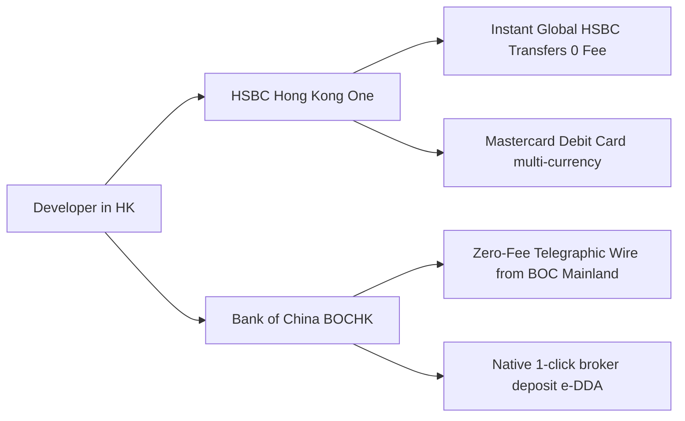

# Hong Kong Tier-1 Banking: HSBC vs Bank of China (BOCHK)

As the two preeminent note-issuing institutions in Hong Kong, **HSBC HK (HSBC One)** and **Bank of China Hong Kong (BOCHK)** serve as the bedrock infrastructure for global developers, remote workers, and cross-border investors.

## 1. Feature Breakdown & Direct Comparison

| Feature | HSBC Hong Kong (HSBC One) | Bank of China HK (BOCHK) |
| :--- | :--- | :--- |
| **Killer Feature** | **Instant 0-fee Global View Transfers** across worldwide HSBC accounts | **Zero telegraphic and correspondent bank fees** when receiving wires from BOC Mainland |
| **Physical Card** | HSBC Mastercard Debit Card (automatic settlement in 12 global currencies) | BOC HK Dual-Currency UnionPay / Mastercard Debit |
| **Mobile Experience** | Sleek international UI, native multi-language support | Rich domestic Chinese localization, seamless broker linkage |
| **Maintenance Fees** | **Zero minimum balance requirement** (HSBC One tier) | **Zero minimum balance fee** |

## 2. In-Person Onboarding Checklist

1. **Exit-Entry Permit (EEP)** with valid HK endorsement.
2. **Landing Slip**: Small paper issued at customs immigration—**strictly required by branch staff**.
3. **National Identity Card**.
4. **Proof of Residential Address**: Credit card statement or utility bill within 3 months showing matching legal name and address.
5. **Employment Evidence / Business Card / Tax ID**.

## 3. Optimal Routing Strategy

- **Dual Setup**: Hold both HSBC HK and BOCHK accounts simultaneously.
- **Efficient Capital Flow**:
  1. Purchase foreign currency via Bank of China Mainland and telegraphic wire to **BOCHK** with minimal fee;
  2. Free instant transfer from BOCHK to **HSBC HK** via **FPS (Faster Payment System)**;
  3. Bind the HSBC Mastercard Debit card to pay for OpenAI/Anthropic/AWS infrastructure globally.
