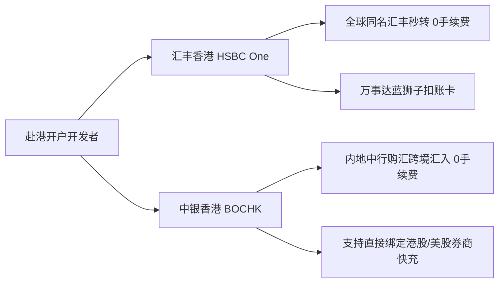

# 香港传统大行开户对决：汇丰 (HSBC) VS 中银香港 (BOCHK)

作为香港金融体系中最核心的两大发钞行，**汇丰香港（HSBC HK One）** 与 **中银香港（BOCHK）** 是每一位出海开发者、跨境投资者必备的底层账户。

## 1. 核心定位与优缺点对比

| 维度 | 汇丰香港 (HSBC One) | 中银香港 (BOCHK) |
| :--- | :--- | :--- |
| **最大王牌优势** | **全球汇丰同名账户互转秒到、0 手续费**（Global View） | **内地中行跨境电汇免电报费与中转费**（成本极低） |
| **实体借记卡** | 汇丰万事达蓝狮子 Debit Card（全球 12 种货币自动扣款） | 中银香港万事达 / 银联双币卡 |
| **App 体验** | 国际化、支持多语言、界面简洁极客 | 中文本地化友好，网银转账与券商出入金极顺畅 |
| **管理费门槛** | 普通综合理财账户（HSBC One）**永久免管理费** | 普通账户**永久免管理费** |

## 2. 赴港开户必备材料清单

1. **港澳通行证**（有效签注并在有效期内）。
2. **过关小票（入境标签 Landing Slip）**：过关时机器吐出的小白条，**务必妥善保管，银行必查**。
3. **中华人民共和国居民身份证**。
4. **地址证明**（建议准备近 3 个月内的信用卡纸质账单或公用事业账单，需带本人姓名与地址）。
5. **在职证明 / 名片 / 个人税号（身份证号）**。

## 3. 开户策略建议

- **最佳组合**：**汇丰 + 中银双持**。
- **资金路由闭环**：
  1. 通过内地中国银行购汇（港币/美元），免费电汇至 **中银香港**；
  2. 在中银香港通过 **FPS（转数快）** 秒级免费转入 **汇丰香港**；
  3. 通过汇丰香港借记卡支付全球 AI 算力与订阅账单，或入金至全球券商。

---

> 🔗 **微信公众号原文**：[香港银行开户攻略：汇丰VS中银](http://mp.weixin.qq.com/s?__biz=Mzk0NzYxMDM0Mw==&mid=2247483798&idx=1&sn=6d048bb83186bc2b0665eba076634f1f) | [汇丰香港账户实操](http://mp.weixin.qq.com/s?__biz=Mzk0NzYxMDM0Mw==&mid=2247483793&idx=1&sn=2a8ce57b01ff7ad88c596e51a243565d)

