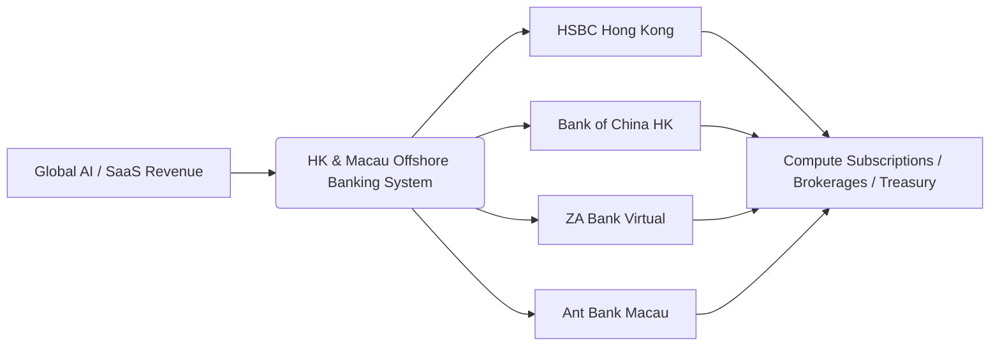

# 💳 Cross-Border Finance & Offshore Banking

:::info Disclaimer
All guides in this section are based on the author's **first-hand personal experience** opening and operating offshore bank accounts and cross-border capital routings. It is for technical sharing only and does not constitute financial, investment, or tax advice.
:::

For AI Agent builders, indie makers, and global tech nomads, the foundational layer of autonomy is **offshore banking infrastructure and multi-currency liquidity**.

## 🏦 Practical Guides Index

1. **[01. Why AI Agent Developers Care About HK & Macau Financial Infrastructure](/en-US/finance/ai-agent-offshore-infrastructure)**  
   *Deconstructing the connection between AI productivity and offshore billing/settlement.*

2. **[02. Hong Kong Banking Showdown: HSBC vs BOCHK Practical Comparison](/en-US/finance/hsbc-vs-bochk)**  
   *Deep dive into HK's top two note-issuing banks: Global HSBC transfers vs BOC fee-free wires.*

3. **[03. ZA Bank Hong Kong: Rapid Digital Onboarding & Real Experience](/en-US/finance/za-bank-guide)**  
   *Hong Kong's leading virtual bank: 100% branchless online setup within minutes.*

4. **[04. Beyond Travel & Dining: Setting Up Ant Bank Macau](/en-US/finance/macau-ant-bank-guide)**  
   *Frictionless setup for an Ant Group-backed regulated multi-currency offshore account.*

5. **[05. Global Address Validator & Formatter Tool](/en-US/finance/address-validator)**  
   *Interactive global map geocoding & standard offshore address generator for Wise, Stripe, and bank KYC.*
