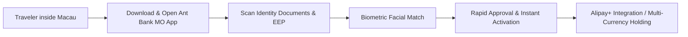

# Beyond Travel & Dining: Setting Up Ant Bank Macau

When visiting Macau, developers and digital nomads can easily open a legitimate, regulated offshore bank account backed by **Ant Group—Ant Bank (Macao)** in just a few minutes.

## 1. Key Value Proposition of Ant Bank Macau

- **Frictionless Entry Barrier**: While physically in Macau, no complex proof of address or heavy financial statements are required—only your identity card and travel permit.
- **Multi-Currency Vault**: Supports holding and settlement in Macau Pataca (MOP), Hong Kong Dollars (HKD), Chinese Yuan (CNY), and USD.
- **Ant Ecosystem Synergies**: Seamless integration with cross-border payment rails, serving as an effective auxiliary bridge in personal capital routing.

## 2. Step-by-Step Onboarding

1. **Local Connectivity**: Ensure connection to local Macau cellular networks or Wi-Fi.
2. **App Installation**: Download `Ant Bank (Macao)` from the iOS App Store / Google Play.
3. **Identity Verification**: Submit document scans and complete liveness facial biometric checks.
4. **Instant Activation**: Accounts are typically provisioned quickly, ready to receive transfers or participate in promotional cashback offers.
