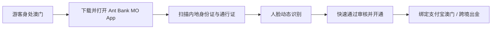

# 去澳门别只顾着吃喝买：澳门蚂蚁银行顺手开户指南

很多人去澳门旅游探店，却不知道在澳门也可以零门槛开立一个由**蚂蚁集团持牌的正规离岸银行账户——澳门蚂蚁银行（Ant Bank Macau）**。

## 1. 澳门蚂蚁银行的核心价值

- **开户门槛极低**：身处澳门境内，无需提供复杂的地址证明或大额资产流水，仅凭身份证、港澳通行证即可在手机上几分钟完成申请。
- **支持多币种**：支持澳门元（MOP）、港币（HKD）、人民币（CNY）及美元等主要币种存储。
- **与蚂蚁生态互通**：支持快速绑定跨境支付与本地消费，亦可作为跨境资金流动的一个重要辅助支线。

## 2. 开户实操步骤

1. **进入澳门范围**：连上澳门当地 Wi-Fi 或蜂窝数据网络。
2. **下载 App**：各大应用商店搜索并安装 `Ant Bank (Macao)`。
3. **身份核验**：按提示拍摄身份证与通行证，完成活体人脸识别。
4. **账户激活**：审核通过后账户即刻生效，可顺畅接收转账或参与官方针对新用户的各项开户激励活动。

---

> 🔗 **微信公众号原文**：[去澳门别只顾着吃喝买，澳门蚂蚁银行可以顺手开一个](http://mp.weixin.qq.com/s?__biz=Mzk0NzYxMDM0Mw==&mid=2247484556&idx=1&sn=58874ffb6ff8ff691f715285fd619075) | [澳门蚂蚁银行开户福利实录](http://mp.weixin.qq.com/s?__biz=Mzk0NzYxMDM0Mw==&mid=2247484806&idx=2&sn=469acf4445cecff46fe136e81aa0fc6d)

