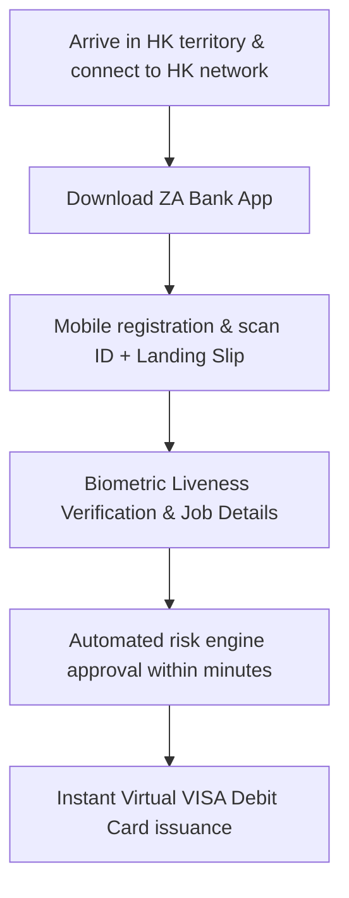

# Hong Kong Virtual Banking: Quick Account Setup with ZA Bank

ZA Bank is Hong Kong's first licensed **Virtual Bank** and currently holds the leading position in digital banking across the region with an exceptionally streamlined mobile experience.

## 1. Key Advantages of ZA Bank

- **100% Branchless**: Complete the entire onboarding workflow directly within the smartphone app as long as you are physically within Hong Kong borders.
- **Customizable Card Number**: Offers free physical Visa Debit Card issuance with customized last 6 digits.
- **High-Yield Liquidity**: Flexible deposit savings products ("ZA Savings+") with competitive multi-currency yields.
- **Native FPS Ecosystem**: Instant, zero-fee clearing with all major HK retail banks and brokerages.

## 2. Practical Onboarding Steps

1. **Geolocation Check**: The app strictly enforces GPS and cellular network verification to ensure physical presence in HK during submission.
2. **Document Checklist**:
   - Mainland Identity Card.
   - Exit-Entry Permit (EEP).
   - HK Customs Landing Slip (must be crisp and legible).
3. **Approval Turnaround**: In standard conditions, automated verification completes in **5 to 15 minutes**.
