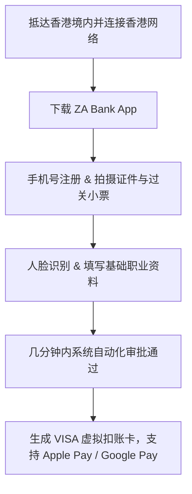

# 港银行开户没你想的麻烦：ZA Bank 几分钟申请实录

众安银行（ZA Bank）是香港首家获发牌照并正式营业的**虚拟银行（Virtual Bank）**，也是目前香港规模最大、体验最顺畅的线上银行之一。

## 1. 为什么选择 ZA Bank？

- **真正零跑网点**：只要人身处香港境内（连接香港基站或 WiFi），全程在手机 App 上即可完成全部开户操作。
- **自定义卡号与实体卡**：支持免费申请实体 Visa 借记卡，卡号后 6 位可自定义，支持全球消费无汇率加价。
- **存款与理财灵活**：提供“钱加+”活期高息收益与灵活的多币种存款计划。
- **完善的 FPS 支持**：无缝对接香港所有传统大行与电子钱包。

## 2. 线上申请实操要点

1. **地理位置确认**：App 在开户过程中会通过 GPS 和基站校验设备是否在香港境内。
2. **准备材料**：
   - 居民身份证原件
   - 港澳通行证原件
   - 入境纸（过关小白条，需平整拍照上传）
3. **开户时效**：资料清晰的情况下，系统通常在 **5~15 分钟** 内完成自动风控并下户。

---

> 🔗 **微信公众号原文**：[港银行开户没你想的麻烦：ZA Bank 几分钟申请，福利别错过](http://mp.weixin.qq.com/s?__biz=Mzk0NzYxMDM0Mw==&mid=2247484544&idx=1&sn=1f18618d78b0201626e421add7c92bdc)

